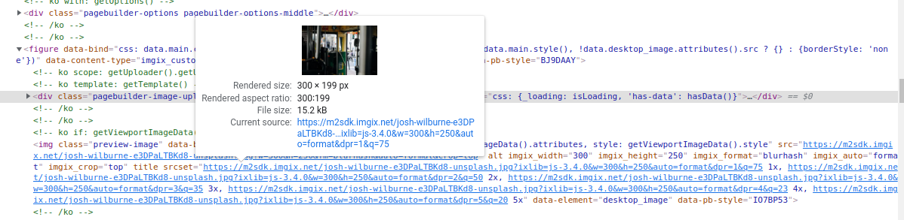

Use npm Packages in Magento 2
==============================

You can integrate npm packages into your Magento 2 custom modules to extend functionality with modern JavaScript libraries.

Overview
--------

This guide demonstrates how to use the `@imgix/js-core`_ npm package in a custom Magento 2 module. ``@imgix/js-core`` is a JavaScript library for generating image URLs with srcset attributes, but the same approach can be applied to any npm package.

.. _`@imgix/js-core`: https://github.com/imgix/js-core

Installation Steps
------------------

Follow these steps to integrate any npm package into your custom Magento 2 module.

#. Navigate to your module's web directory:

    .. code-block:: bash

        cd <magento_root>/app/code/Vendor/Module/view/adminhtml/web

#. Initialize npm to create a ``package.json`` file:

    .. code-block:: bash

        npm init

    Follow the prompts to set up your package configuration.

#. After running ``npm init``, a ``package.json`` file is generated:

    .. code-block:: json

        {
            "name": "Magento 2 imgix package",
            "version": "1.0.0",
            "description": "Integration of imgix package in Magento 2",
            "main": "index.js",
            "scripts": {
                "test": "echo \"Error: no test specified\" && exit 1"
            },
            "author": "Imgix",
            "license": "ISC"
        }

#. Install the ``@imgix/js-core`` npm package:

    .. code-block:: bash

        npm install @imgix/js-core

    This will create the ``node_modules`` directory and ``package-lock.json`` file.

    .. note::
        The ``node_modules`` directory contains all the package dependencies, and ``package-lock.json`` locks the versions for consistent installations.

#. Configure RequireJS to include the npm package in ``requirejs-config.js``:

    .. code-block:: javascript
        :caption: app/code/Vendor/Module/view/adminhtml/requirejs-config.js

        var config = {
            paths: {
                ImgixClient: 'Vendor_Module/node_modules/@imgix/js-core/dist/imgix-js-core.umd'
            }
        };

    This maps the ``ImgixClient`` alias to the npm package's distribution file.

Usage Example
-------------

Now you can use the npm package in your module's JavaScript files:

.. code-block:: javascript

    require([
        'jquery',
        'ImgixClient'
    ], function ($, ImgixClient) {

        // Your code here

        // Initialize the Imgix client
        const client = new ImgixClient({
            domain: 'testing.imgix.net',
            secureURLToken: 'my-token',
            includeLibraryParam: false,
        });

        // Generate srcset for responsive images
        const srcset = client.buildSrcSet(
            'image.jpg',
            {
                h: 800,
                ar: '3:2',
                fit: 'crop',
            },
            {
                devicePixelRatios: [1, 2],
            },
        );

        console.log(srcset);

        // Additional code...
    });

Result
------

The ``srcset`` attribute is generated and added to the img tag. Here's the output:

    Srcset attribute generated in the img tag

Benefits
--------

Using npm packages in Magento 2 provides several advantages:

- **Modern JavaScript Libraries**: Access to thousands of npm packages
- **Better Dependency Management**: npm handles package versions and dependencies
- **Code Reusability**: Use well-tested, community-maintained libraries
- **Easy Updates**: Simple package updates with npm commands

.. tip::
    Remember to add the ``node_modules`` directory to your ``.gitignore`` file to avoid committing large dependency files to your repository. Team members can install dependencies using ``npm install``.
