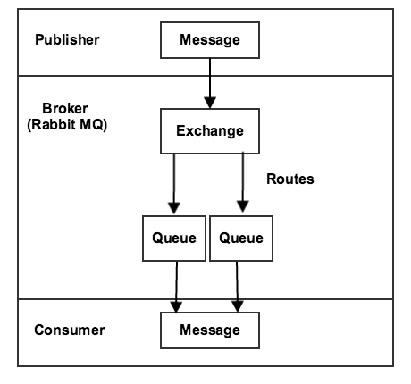
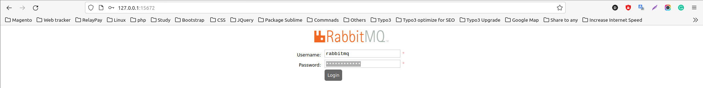
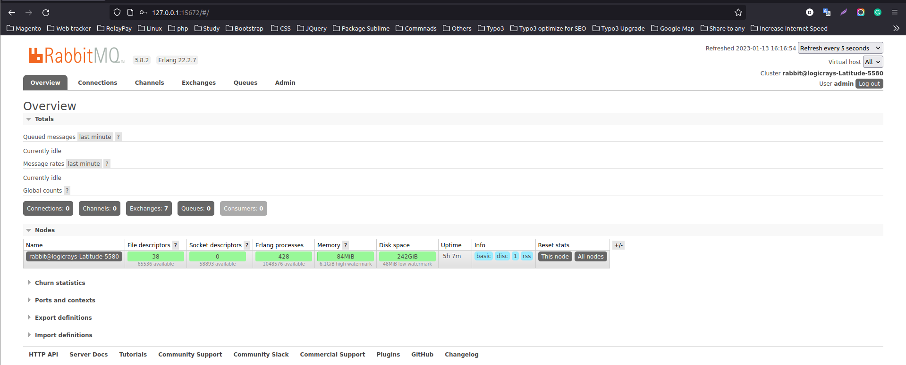

RabbitMQ in Magento 2
=====================

Overview
--------

RabbitMQ is an open-source message broker that offers a reliable, highly available, scalable, and portable messaging system.

Message queues provide an asynchronous communications mechanism in which the sender and receiver of a message do not contact each other. They also don't need to communicate with the message queue at the same time. When a sender places a message onto a queue, it is stored until the recipient receives it.

RabbitMQ is an open-source message queuing software implemented in `Erlang OTP`_. It implements the **AMQP (Advanced Message Queuing Protocol)** and uses plugins to communicate with popular messaging solutions like **MQTT (Message Queuing Telemetry Transport)**, Streaming Text Oriented Messaging Protocol, and others.

.. _`Erlang OTP`: https://www.erlang.org/

This guide covers the installation and configuration of RabbitMQ Server for Magento 2.

.. important::
    The message queue system must be established **before** you install Magento.

Installation Sequence
~~~~~~~~~~~~~~~~~~~~~

The basic installation sequence is:

1. Install RabbitMQ and any prerequisites
2. Connect RabbitMQ to Magento

Code Structure
~~~~~~~~~~~~~~

The message queue code is located in several different modules, which can make it difficult to navigate at first. However, each module has a distinct purpose:

**Module Structure:**

- **magento/framework-message-queue**: Contains abstract message queue code that's shared by all implementations
- **magento/module-message-queue**: Contains the code needed to list and run consumers
- **magento/module-mysql-mq**: Contains the code to create a database adapter (identified as ``db``)
- **magento/module-amqp**: Contains the code to create an `AMQP`_ adapter (RabbitMQ adapter, identified as ``amqp``)

.. _AMQP: https://en.wikipedia.org/wiki/Advanced_Message_Queuing_Protocol

Connection Adapters
~~~~~~~~~~~~~~~~~~~

Magento provides two connection adapters by default:

Database Adapter
^^^^^^^^^^^^^^^^

The database adapter is a basic implementation that stores messages in database tables and uses cron to trigger message collection.

**Database Tables:**

- **queue**: Contains a list of queues
- **queue_message**: Contains message data in JSON format
- **queue_message_status**: Contains status entries related to the queue_message table

**Status Mapping:**

- ``2`` = New
- ``3`` = In Progress
- ``4`` = Complete
- ``5`` = Retry Required
- ``6`` = Error
- ``7`` = To Be Deleted

AMQP Adapter
^^^^^^^^^^^^

The AMQP adapter defers message handling to an AMQP-compatible application, such as RabbitMQ. It does not require the additional tables and cleanup functionality of the database adapter.

Instead of creating database tables, the installer scripts create the necessary exchanges, queues, consumers, and bindings in RabbitMQ according to the latest queue configuration. These are kept up-to-date by a recurring installer script, which means that any changes to configuration in ``queue.xml`` are applied to RabbitMQ when running::

    magento setup:upgrade

**Reference**: `Magento CLI Commands <https://experienceleague.adobe.com/en/docs/commerce-operations/configuration-guide/cli/config-cli>`_

Message Queue Framework Architecture
-------------------------------------

The following diagram illustrates the Message Queue Framework:

    Message Queue Framework Architecture

Components
~~~~~~~~~~

**Publisher**
    A component that sends messages to an exchange. It knows which exchange to publish to and the format of the messages it sends.

**Exchange**
    Receives messages from publishers and sends them to queues.

**Queue**
    A buffer that stores messages.

**Consumer**
    Receives messages. It knows which queue to consume and can map message processors to specific queues.

Message Queue Status
--------------------

Magento uses asynchronous operations for managing the MySQL implementation of the message queue.

Status Management
~~~~~~~~~~~~~~~~~

Magento stores queue status in the ``queue_message_status`` table to manage the relationship between queues and messages. The ``status`` column defines the status of message queues.

The ``QueueManagement`` class defines the following status constants:

.. code-block:: php

    const MESSAGE_STATUS_NEW = 2;
    const MESSAGE_STATUS_IN_PROGRESS = 3;
    const MESSAGE_STATUS_COMPLETE = 4;
    const MESSAGE_STATUS_RETRY_REQUIRED = 5;
    const MESSAGE_STATUS_ERROR = 6;
    const MESSAGE_STATUS_TO_BE_DELETED = 7;

**Status Descriptions:**

- **Status 2 (New)**: Message is just generated and not yet processed
- **Status 3 (In Progress)**: Message processing has started but not yet completed
- **Status 4 (Complete)**: Message has been processed and completed successfully
- **Status 5 (Retry Required)**: Message requires retry and is not completed yet
- **Status 6 (Error)**: Message encountered an error during processing
- **Status 7 (To Be Deleted)**: Message is marked for deletion

Install RabbitMQ Server
-----------------------

**Reference**: https://www.vultr.com/docs/install-rabbitmq-server-ubuntu-20-04-lts

#. Install necessary packages:

    .. code-block:: bash

        sudo apt-get install wget apt-transport-https -y

#. Install the RabbitMQ repository signing key:

    .. code-block:: bash

        wget -O- https://www.rabbitmq.com/rabbitmq-release-signing-key.asc | sudo apt-key add -

#. Add the RabbitMQ repository:

    .. code-block:: bash

       echo "deb https://dl.bintray.com/rabbitmq-erlang/debian focal erlang-22.x" | sudo tee /etc/apt/sources.list.d/rabbitmq.list

#. Install RabbitMQ Server:

    .. code-block:: bash

       sudo apt-get install rabbitmq-server -y --fix-missing

#. Check the status of the RabbitMQ service:

    .. code-block:: bash

       sudo systemctl status rabbitmq-server

    .. figure:: images/install-rabbitmq-server.png
        :align: center
        :alt: RabbitMQ server installation output

        RabbitMQ Server installation verification

Enable RabbitMQ Management Dashboard
------------------------------------

The management dashboard allows you to interact with processes and control activities on the server.

.. code-block:: bash

    sudo rabbitmq-plugins enable rabbitmq_management

.. figure:: images/rabbitmq_management.png
    :align: center
    :alt: RabbitMQ Management plugin enabled

    RabbitMQ Management plugin enabled

Configure RabbitMQ
------------------

**Reference**: https://www.thegeekdiary.com/magento-2-rabbitmq-configuration/

The default user ``guest`` can only log in via **localhost**. You need to create an **administrator** account to access the dashboard remotely.

.. note::
    Make sure to replace ``rabbitmq_pwd`` with your own secure password.

Create User with Permissions
~~~~~~~~~~~~~~~~~~~~~~~~~~~~~

We need to create a user with the appropriate permissions:

.. code-block:: bash

    sudo rabbitmqctl add_user rabbitmq rabbitmq_pwd
    sudo rabbitmqctl set_user_tags rabbitmq administrator
    sudo rabbitmqctl set_permissions -p / rabbitmq ".*" ".*" ".*"

Create Queue
~~~~~~~~~~~~

Create the required queue for Magento:

.. code-block:: bash

    rabbitmqadmin --username=rabbitmq --password=rabbitmq_pwd declare queue --vhost=/ name=async.operations.all durable=true

Access Management Dashboard
~~~~~~~~~~~~~~~~~~~~~~~~~~~~

After enabling the management portal plugin, access the dashboard through your browser at ``http://your_IP:15672`` (port 15672 is the HTTP port for RabbitMQ management).

**Example**: http://127.0.0.1:15672/

    RabbitMQ Management Login

Login Credentials
~~~~~~~~~~~~~~~~~

Log in with the following credentials:

- **Username**: rabbitmq
- **Password**: rabbitmq_pwd (use the password you set earlier)

    RabbitMQ Management Dashboard

    .. figure:: images/rabbitmq-dashboard.png
        :align: center
        :alt: RabbitMQ Management Dashboard

        RabbitMQ Management Dashboard

Magento 2 configuration
-----------------------

If you installed Magento after you installed RabbitMQ, 
add the following command line parameters when you install Magento Open Source or Adobe Commerce::

    --amqp-host="<hostname>" --amqp-port="5672" --amqp-user="<your_user_name>" --amqp-password="<your_password>" --amqp-virtualhost="/"

**where**:

:--amqp-host: The hostname where RabbitMQ is installed.

:--amqp-port: The port to use to connect to RabbitMQ. Port on which RabbitMQ running. The default is 5672.

:--amqp-user: The username for connecting to RabbitMQ. Do not use the default user guest.

:--amqp-password: The password for connecting to RabbitMQ. Do not use the default password guest.

:--amqp-virtualhost: The virtual host for connecting to RabbitMQ. The default is ``/``.

:--amqp-ssl: Indicates whether to connect to RabbitMQ. The default is false. If you set the value to true, see Configure SSL for more information.

Connect RabbitMQ to Magento Open Source or Adobe Commerce
~~~~~~~~~~~~~~~~~~~~~~~~~~~~~~~~~~~~~~~~~~~~~~~~~~~~~~~~~

First of all, We need to add rabbitmq configuration. It can be done in 2 ways:

**Via bin/magento**

.. code-block:: bash

    php bin/magento setup:config:set --amqp-host="127.0.0.1" --amqp-port="5672" --amqp-user="rabbitmq" --amqp-password="rabbitmq_pwd" --amqp-virtualhost="/"

**By editing app/etc/env.php with following lines**

If you already had Magento installed and you want to connect it to RabbitMQ,

add a queue section in the ``<magento_root>/app/etc/env.php`` file so that it is similar to the following

.. code-block:: bash
    
    'queue' => [
        'amqp' => [
            'host' => '127.0.0.1', //host of RabbitMQ
            'port' => '5672', //Port on which RabbitMQ running. 
            'user' => 'rabbitmq', //RabbitMQ user name
            'password' => 'rabbitmq_pwd', //RabbitMQ password
            'virtualhost' => '/' //The virtual host for connecting to RabbitMQ. The default is /.
        ],
    ],  

Also, you'll need to add cron runner to ``app/etc/env.php``:

.. code-block:: bash

    'cron_consumers_runner' => [
        'cron_run' => true,
        'max_messages' => 0,
        'consumers' => [
            'async.operations.all',
            'codegeneratorProcessor'
        ]
    ]

That's all. We successfully configured rabbitmq consumer in Magento.

RabbitMQ Example
----------------

:Create Magento Module: Logicrays_RabbitMQ

#. Create ``registration.php``
    
    .. code-block:: php
        :caption: registration.php

        <?php
        \Magento\Framework\Component\ComponentRegistrar::register(
            \Magento\Framework\Component\ComponentRegistrar::MODULE,
            'Logicrays_RabbitMQ',
            __DIR__
        );

#. Create ``module.xml`` file into etc directory

    .. code-block:: xml
        :caption: etc/module.xml

        <?xml version="1.0"?>
        <config xmlns:xsi="http://www.w3.org/2001/XMLSchema-instance" xsi:noNamespaceSchemaLocation="urn:magento:framework:Module/etc/module.xsd">
            <module name="Logicrays_RabbitMQ" setup_version="1.0.0">
            </module>
        </config>

#. Firstly, we define exchange, topic, queue, publisher and consumer. 
   As you may guess such configuration should be done in ``XML`` 
   files (taken from official Magento message queues guide: https://developer.adobe.com/commerce/php/development/components/message-queues/configuration/):

    :communication.xml: Defines aspects of the message queue system that all communication types have in common.
    :queue_consumer.xml: Defines the relationship between an existing queue and its consumer.
    :queue_topology.xml: Defines the message routing rules and declares queues and exchanges.
    :queue_publisher.xml: Defines the exchange where a topic is published.

#. Create a ``etc/communication.xml`` file and define topic **logicrays.product.delete**

    .. code-block:: xml
       :caption: etc/communication.xml

        <?xml version="1.0"?>
        <config xmlns:xsi="http://www.w3.org/2001/XMLSchema-instance" xsi:noNamespaceSchemaLocation="urn:magento:framework:Communication/etc/communication.xsd">
            <topic name="logicrays.product.delete" request="Magento\Catalog\Api\Data\ProductInterface"/>
        </config>
    
    Also, we specify data type of the topic in **request** attribute: ``Magento\Catalog\Api\Data\ProductInterface``.

#. Then, create ``etc/queue_topology.xml`` file and define **logicrays.product** exchange and bind **LogicraysProductDelete** to route **logicrays.product.delete** topic to **logicrays_product_delete** queue:

    .. code-block:: xml
       :caption: etc/queue_topology.xml

        <?xml version="1.0"?>
        <config xmlns:xsi="http://www.w3.org/2001/XMLSchema-instance" xsi:noNamespaceSchemaLocation="urn:magento:framework-message-queue:etc/topology.xsd">
            <exchange name="logicrays.product" type="topic" connection="amqp">
                <binding id="LogicraysProductDelete" topic="logicrays.product.delete" destinationType="queue" destination="logicrays_product_delete"/>
            </exchange>
        </config>
    
    .. note::

        connection type ``amqp`` in the file above.
    
#. Create ``etc/queue_publisher.xml`` file. No publisher classes are specified here:

    .. code-block:: xml
       :caption: etc/queue_publisher.xml

        <?xml version="1.0"?>
        <config xmlns:xsi="http://www.w3.org/2001/XMLSchema-instance" xsi:noNamespaceSchemaLocation="urn:magento:framework-message-queue:etc/publisher.xsd">
            <publisher topic="logicrays.product.delete">
                <connection name="amqp" exchange="logicrays.product" />
            </publisher>
        </config>
    
#. Create a ``etc/queue_consumer.xml`` file, we define **consumer** and specify class and method that processes message i.e. handler:

    .. code-block:: xml
       :caption: etc/queue_consumer.xml

        <?xml version="1.0"?>
        <config xmlns:xsi="http://www.w3.org/2001/XMLSchema-instance" xsi:noNamespaceSchemaLocation="urn:magento:framework-message-queue:etc/consumer.xsd">
            <consumer name="LogicraysProductDelete" queue="logicrays_product_delete" connection="amqp" handler="Logicrays\RabbitMQ\Model\Product\DeleteConsumer::processMessage"/>
        </config>

#. We are done with configuration. If everything is defined right after running ``php bin/magento setup:upgrade`` we should have exchange and queue created on RabbitMQ server:

    .. figure:: images/RabbitMQ-configure-done.png
        :align: center

#. Let's continue with creating publisher class. 
    
    It is ``\Logicrays\RabbitMQ\Model\Product\DeletePublisher``. Here we need to specify topic name as a constant and declare method that will publish a message to the queue.

    .. code-block:: php
       :caption: Model/Product/DeletePublisher.php

       <?php

        namespace Logicrays\RabbitMQ\Model\Product;

        class DeletePublisher
        {
            public const TOPIC_NAME = 'logicrays.product.delete';

            /**
            * @var \Magento\Framework\MessageQueue\PublisherInterface
            */
            private $publisher;

            /**
            * @param \Magento\Framework\MessageQueue\PublisherInterface $publisher
            */
            public function __construct(\Magento\Framework\MessageQueue\PublisherInterface $publisher)
            {
                $this->publisher = $publisher;
            }

            /**
            * @inheritdoc
            */
            public function execute(\Magento\Catalog\Api\Data\ProductInterface $product)
            {
                $this->publisher->publish(self::TOPIC_NAME, $product);
            }
        }

    Product object will be automatically encoded to JSON.

#. Next create a plugin where we track product delete event  and call execute method of publisher:

    .. code-block:: xml
       :caption: etc/di.xml

        <?xml version="1.0"?>
        <config xmlns:xsi="http://www.w3.org/2001/XMLSchema-instance" xsi:noNamespaceSchemaLocation="urn:magento:framework:ObjectManager/etc/config.xsd">
            <type name="Magento\Catalog\Model\ResourceModel\Product">
                <plugin name="publish_product_delete" type="Logicrays\RabbitMQ\Plugin\ProductDeletePlugin"/>
            </type>
        </config>

#. Create ``ProductDeletePlugin.php`` file

    .. code-block:: php
       :caption: Plugin/ProductDeletePlugin.php

        <?php

        namespace Logicrays\RabbitMQ\Model\Product;

        class DeletePublisher
        {
            public const TOPIC_NAME = 'logicrays.product.delete';

            /**
            * @var \Magento\Framework\MessageQueue\PublisherInterface
            */
            private $publisher;

            /**
            * @param \Magento\Framework\MessageQueue\PublisherInterface $publisher
            */
            public function __construct(\Magento\Framework\MessageQueue\PublisherInterface $publisher)
            {
                $this->publisher = $publisher;
            }

            /**
            * @inheritdoc
            */
            public function execute(\Magento\Catalog\Api\Data\ProductInterface $product)
            {
                $this->publisher->publish(self::TOPIC_NAME, $product);
            }
        }

#. Create handler ``DeleteConsumer.php`` that we specified in ``queue_consumer.xml``

    .. code-block:: php
       :caption: Model/Product/DeleteConsumer.php

        <?php

        namespace Logicrays\RabbitMQ\Model\Product;

        use Magento\Framework\App\Filesystem\DirectoryList;
        use Magento\Framework\Exception\FileSystemException;

        class DeleteConsumer
        {
            /**
            * @var \Zend\Log\Logger
            */
            private $logger;

            /**
            * @var string
            */
            private $logFileName = 'product-delete-consumer.log';

            /**
            * @var DirectoryList
            */
            private $directoryList;

            /**
            * DeleteConsumer constructor.
            * @param DirectoryList $directoryList
            * @throws FileSystemException
            */
            public function __construct(
                \Magento\Framework\App\Filesystem\DirectoryList $directoryList
            ) {
                $this->directoryList = $directoryList;
                $logDir = $directoryList->getPath('log');
                $writer = new \Zend\Log\Writer\Stream($logDir . DIRECTORY_SEPARATOR . $this->logFileName);
                $logger = new \Zend\Log\Logger();
                $logger->addWriter($writer);
                $this->logger = $logger;
            }

            /**
            * _processMessage
            *
            * @param \Magento\Catalog\Api\Data\ProductInterface $product
            * @throws \Magento\Framework\Exception\LocalizedException
            * @return void
            */
            public function processMessage(\Magento\Catalog\Api\Data\ProductInterface $product)
            {
                $this->logger->info($product->getId() . ' ' . $product->getSku());
            }
        }

#. ``processMessage`` method expects instance of ``\Magento\Catalog\Api\Data\ProductInterface`` as parameter. 

    The last step is to start our consumer with command::
        
        php bin/magento queue:consumers:start LogicraysProductDelete

#. You can download source code from here: https://github.com/dipakp-logicrays/rabbitmq-example

Basic Information about RabbitMQ files
--------------------------------------

You should create following files in below order.
    
    - communication.xml
    - queue_publisher.xml
    - queue_topology.xml
    - queue_consumer.xml

communication.xml
~~~~~~~~~~~~~~~~~

- topic ``name`` should be unique.

- ``request`` will be type like interface, string or other etc.

- Example:

    .. code-block:: xml

	    <topic name="logicrays.product.delete" request="Magento\Catalog\Api\Data\ProductInterface"/>

queue_publisher.xml
~~~~~~~~~~~~~~~~~~~
	
- publisher ``topic`` is comes from the ``communication.xml``'s **topic name**.

- connection ``name`` should be **amqp**.

- connection ``exchange`` should be unique.

- Example:

    .. code-block:: xml

        <publisher topic="logicrays.product.delete">
            <connection name="amqp" exchange="logicrays.product" />
        </publisher>

queue_topology.xml
~~~~~~~~~~~~~~~~~~

- exchange ``name`` is comes from the ``queue_publisher.xml``'s **exchange** value.

- exchange  ``type`` should queue.

- binding ``id`` should be unique.

- binding ``topic`` comes from the ``communication.xml`` **topic name**.

- ``destinationType`` should be **queue**.

- ``destination`` should be unique.

- Example:

    .. code-block:: xml

        <exchange name="logicrays.product" type="topic" connection="amqp">
            <binding id="LogicraysProductDelete" 
                topic="logicrays.product.delete"
                destinationType="queue"
                destination="logicrays_product_delete"/>
        </exchange>

queue_consumer.xml
~~~~~~~~~~~~~~~~~~

- consumer ``name`` should be same as queue_topology.xml exchange's binding id.

- ``queue`` is comes frome the ``queue_topology.xml``'s **destination**.

- ``connection`` should be amqp.

-  ``handler`` set the path of processMessage method.

- ``processMessage`` is method will consume the message.

- Example:

    .. code-block:: xml

        <consumer name="LogicraysProductDelete"
            queue="logicrays_product_delete" 
            connection="amqp" 
            handler="Logicrays\RabbitMQ\Model\Product\DeleteConsumer::processMessage"/>

Create Publisher Class
~~~~~~~~~~~~~~~~~~~~~~

- You have to create publisher class module root path or inside model directory.

- I have ``DeletePublisher`` class insdide ``Logicrays\RabbitMQ\Model\Product`` directory.

- Define ``const TOPIC_NAME`` that are created in ``communication.xml``.

- Example:

    .. code-block:: php

        <?php

        namespace Logicrays\RabbitMQ\Model\Product;

        class DeletePublisher
        {
            public const TOPIC_NAME = 'logicrays.product.delete';

            /**
            * @var \Magento\Framework\MessageQueue\PublisherInterface
            */
            private $publisher;

            /**
            * @param \Magento\Framework\MessageQueue\PublisherInterface $publisher
            */
            public function __construct(\Magento\Framework\MessageQueue\PublisherInterface $publisher)
            {
                $this->publisher = $publisher;
            }

            /**
            * @inheritdoc
            */
            public function execute(\Magento\Catalog\Api\Data\ProductInterface $product)
            {
                $this->publisher->publish(self::TOPIC_NAME, $product);
            }
        }
        
How to consume message in queue
~~~~~~~~~~~~~~~~~~~~~~~~~~~~~~~

- Finally, You have to use publisher class and consume to message from queue.

- In ``__construct``, I have define custom logger.

- When successfully consume the our message from the queue, it will print the log into ``<magento_root>/var/log/product-delete-consumer.log``.

- Example:

    .. code-block:: php

        <?php

        namespace Logicrays\RabbitMQ\Model\Product;

        use Magento\Framework\App\Filesystem\DirectoryList;
        use Magento\Framework\Exception\FileSystemException;

        class DeleteConsumer
        {
            /**
            * @var \Zend\Log\Logger
            */
            private $logger;

            /**
            * @var string
            */
            private $logFileName = 'product-delete-consumer.log';

            /**
            * @var DirectoryList
            */
            private $directoryList;

            /**
            * DeleteConsumer constructor.
            * @param DirectoryList $directoryList
            * @throws FileSystemException
            */
            public function __construct(
                \Magento\Framework\App\Filesystem\DirectoryList $directoryList
            ) {
                $this->directoryList = $directoryList;
                $logDir = $directoryList->getPath('log');
                $writer = new \Zend\Log\Writer\Stream($logDir . DIRECTORY_SEPARATOR . $this->logFileName);
                $logger = new \Zend\Log\Logger();
                $logger->addWriter($writer);
                $this->logger = $logger;
            }

            /**
            * _processMessage
            *
            * @param \Magento\Catalog\Api\Data\ProductInterface $product
            * @throws \Magento\Framework\Exception\LocalizedException
            * @return void
            */
            public function processMessage(\Magento\Catalog\Api\Data\ProductInterface $product)
            {
                $this->logger->info($product->getId() . ' ' . $product->getSku());
            }
        }

Conversion of Magento 2 Queue from MySQL to AMQP
------------------------------------------------

If you want to convert or migrate data of the Magento 2 Queue from MySQL to AMQP,
execute the following operation: Generate coupon code operation using AMQP.

#. Add below code to ``<magento_root>/app/etc/env.php`` file.

    .. code-block:: php
        
        <?php

        'queue' => [
            'topics' => [
                'sales_rule.codegenerator' => [
                    'publisher' => 'amqp-magento'
                ]
            ],
            'config' => [
                'publishers' => [
                    'sales_rule.codegenerator' => [
                        'connections' => [
                            'amqp' => [
                                'name' => 'amqp',
                                'exchange' => 'magento',
                                'disabled' => false
                            ],
                            'db' => [
                                'name' => 'db',
                                'disabled' => true
                            ]
                        ]
                    ]
                ]
            ],
            'consumers' => [
                'sales_rule.codegenerator' => [
                    'connection' => 'amqp',
                ],
            ],
        ],

#. Create cart price rule from admin and save it.

#. Generate specific coupon code.

#. Message added to queue now

    .. figure:: images/db-amqp/generate-coupon-code.png
        :align: center
        :alt: generate-coupon-code

#. In RabbitMQ dashboard, message will appear on exchange tab

    .. figure:: images/db-amqp/mq-exchange.png
        :align: center
        :alt: mq-exchange.png

#. In queue tab, you will see ``codegenerator`` menu

    .. figure:: images/db-amqp/mq-queue-tab.png
        :align: center
        :alt: mq-exchange

#. On click ``codegenerator`` menu, Go to ``Get messages``, Click on ``Get Message(s)`` button, you will get message
    
    .. figure:: images/db-amqp/mq-get-message.png
        :align: center
        :alt: mq-exchange

Conclusion
----------

RabbitMQ is a powerful message broker which can help to improve your store speed.
Also, it will be helpful to decrease the load on your MySQL server which can be helpful during load spikes.