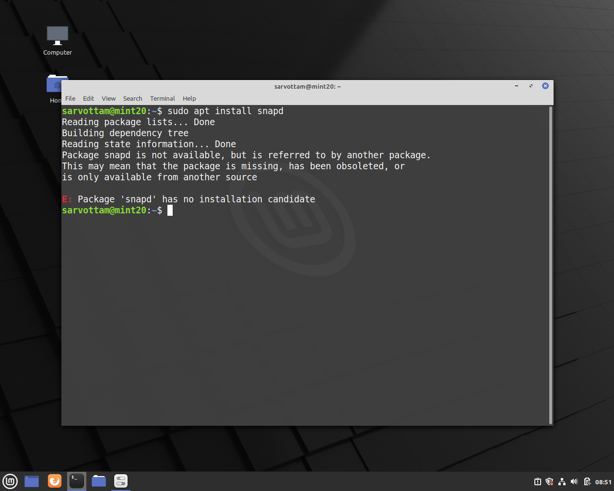
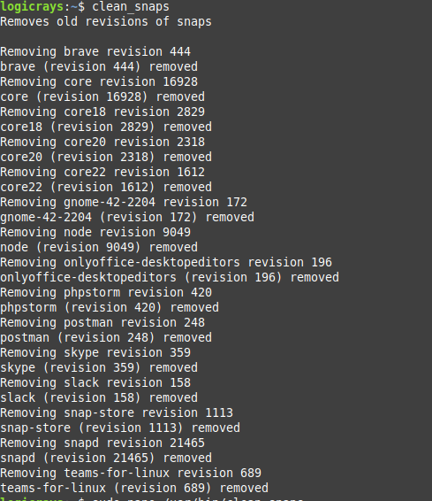

Linux Snap Package Management
==============================

Snaps are Linux app packages for desktop, cloud, and IoT that are self-contained, simple to install, secure, cross-platform, and dependency-free. This guide covers everything you need to know about using Snap packages.

.. note::
    **Official Resources:**

    - `Official Website <https://snapcraft.io/>`_
    - `Snap Documentation <https://snapcraft.io/docs>`_
    - `Snap Store Guide <https://linuxmint-user-guide.readthedocs.io/en/latest/snap.html>`_

What is Snap?
-------------

Snaps are containerized software packages that work across different Linux distributions. They bundle all dependencies, ensuring applications run consistently regardless of the underlying system.

Benefits of Snap
~~~~~~~~~~~~~~~~

- **Self-contained**: All dependencies bundled together
- **Simple to install**: One command installation
- **Secure**: Isolated from the rest of the system
- **Cross-platform**: Works on multiple Linux distributions
- **Dependency-free**: No dependency conflicts
- **Automatic updates**: Background updates by default
- **Easy rollback**: Revert to previous versions easily

Installing Snap on Linux Mint
------------------------------

Linux Mint blocks snap by default. Follow these steps to enable snap support.

.. important::
    **Reference**: `Installing Snap on Linux Mint <https://snapcraft.io/docs/installing-snap-on-linux-mint>`_

Step 1: Remove nosnap.pref File
~~~~~~~~~~~~~~~~~~~~~~~~~~~~~~~~

Move the nosnap.pref file that blocks snap installation::

    sudo mv /etc/apt/preferences.d/nosnap.pref ~/Documents/nosnap.backup

This moves the file to your Documents folder as a backup.

Step 2: Update Package Database
~~~~~~~~~~~~~~~~~~~~~~~~~~~~~~~~

Update the package list::

    sudo apt update

Step 3: Install snapd
~~~~~~~~~~~~~~~~~~~~~

Install the snap daemon::

    sudo apt install snapd

Step 4: Verify Installation
~~~~~~~~~~~~~~~~~~~~~~~~~~~~

Check snap version to verify successful installation::

    snap --version

Troubleshooting Installation
~~~~~~~~~~~~~~~~~~~~~~~~~~~~~

If you encounter errors during installation, refer to this solution:

    Snap installation error example

.. seealso::
    `Enable Snaps Support on Linux Mint 20 <https://unix.stackexchange.com/questions/593366/how-to-enable-snaps-support-on-linux-mint-20>`_

Installing Snap on Other Linux Distributions
---------------------------------------------

Ubuntu
~~~~~~

Snap comes pre-installed on Ubuntu 16.04 and later. If not installed::

    sudo apt update
    sudo apt install snapd

Debian
~~~~~~

::

    sudo apt update
    sudo apt install snapd
    sudo snap install core

Fedora
~~~~~~

::

    sudo dnf install snapd

Arch Linux
~~~~~~~~~~

::

    git clone https://aur.archlinux.org/snapd.git
    cd snapd
    makepkg -si

Installing Applications with Snap
----------------------------------

Basic Installation Syntax
~~~~~~~~~~~~~~~~~~~~~~~~~~

::

    sudo snap install <package-name>

Common Applications
~~~~~~~~~~~~~~~~~~~

**Communication Tools**

Install Slack::

    sudo snap install slack

Install Microsoft Teams::

    sudo snap install teams-for-linux

**Development Tools**

Install Postman::

    sudo snap install postman

Install PHPStorm::

    sudo snap install phpstorm --classic

Install VS Code::

    sudo snap install code --classic

**Browsers**

Install Brave Browser::

    sudo snap install brave

Install Chromium::

    sudo snap install chromium

**Utilities**

Install Snap Store (GUI for managing snaps)::

    sudo snap install snap-store

Install VLC Media Player::

    sudo snap install vlc

Install GIMP::

    sudo snap install gimp

Installing with Different Confinement Modes
~~~~~~~~~~~~~~~~~~~~~~~~~~~~~~~~~~~~~~~~~~~~

Snap packages can have different confinement levels:

**Classic Confinement** (full system access)::

    sudo snap install <package-name> --classic

Example::

    sudo snap install phpstorm --classic

**Strict Confinement** (default, sandboxed)::

    sudo snap install <package-name>

**Devmode** (for testing, reduced security)::

    sudo snap install <package-name> --devmode

Snap Commands Reference
-----------------------

Checking Version
~~~~~~~~~~~~~~~~

Check installed snap version::

    snap --version

Searching for Packages
~~~~~~~~~~~~~~~~~~~~~~

**Search by name or description**::

    snap find <search-term>

Examples::

    snap find "media player"
    snap find editor
    snap find browser

**Search for specific package**::

    snap info <package-name>

Example::

    snap info vlc

Listing Installed Snaps
~~~~~~~~~~~~~~~~~~~~~~~~

**List all installed snaps**::

    snap list

**List all revisions (including disabled)**::

    snap list --all

Output includes:

- Name
- Version
- Revision number
- Tracking channel
- Publisher
- Notes

Installing Packages
~~~~~~~~~~~~~~~~~~~

**Install from stable channel (default)**::

    sudo snap install <package-name>

**Install from specific channel**::

    sudo snap install <package-name> --channel=<channel>

Channels: stable, candidate, beta, edge

Example::

    sudo snap install vlc --channel=edge

**Install specific revision**::

    sudo snap install <package-name> --revision=<number>

Updating Packages
~~~~~~~~~~~~~~~~~

**Update all installed snaps**::

    sudo snap refresh

**Update specific snap**::

    sudo snap refresh <package-name>

Example::

    sudo snap refresh teams-for-linux

**Check for available updates**::

    snap refresh --list

Removing Packages
~~~~~~~~~~~~~~~~~

**Remove a snap package**::

    sudo snap remove <package-name>

Example::

    sudo snap remove slack

**Remove snap and purge data**::

    sudo snap remove <package-name> --purge

Reverting to Previous Version
~~~~~~~~~~~~~~~~~~~~~~~~~~~~~~

**Revert to previous revision**::

    sudo snap revert <package-name>

Example::

    sudo snap revert firefox

Managing Snap Services
~~~~~~~~~~~~~~~~~~~~~~

**List services**::

    snap services

**Start a service**::

    sudo snap start <package-name>.<service-name>

**Stop a service**::

    sudo snap stop <package-name>.<service-name>

**Restart a service**::

    sudo snap restart <package-name>.<service-name>

Viewing Snap Information
~~~~~~~~~~~~~~~~~~~~~~~~

**View detailed package information**::

    snap info <package-name>

**View snap changes (history)**::

    snap changes

**View specific change details**::

    snap change <change-id>

Cleaning Up Old Snap Revisions
-------------------------------

Snap keeps old revisions for rollback purposes. Over time, these can consume disk space.

Understanding Snap Revisions
~~~~~~~~~~~~~~~~~~~~~~~~~~~~~

By default, Snap keeps 3 revisions of each package:

- Current active revision
- Previous 2 revisions for rollback

Manual Cleanup
~~~~~~~~~~~~~~

**List all revisions including disabled ones**::

    snap list --all

**Remove specific revision**::

    sudo snap remove <package-name> --revision=<revision-number>

Example::

    sudo snap remove firefox --revision=1234

Automated Cleanup Script
~~~~~~~~~~~~~~~~~~~~~~~~

Create a script to automatically clean old snap revisions.

.. important::
    **Reference**: `Cleanup Snaps Guide <https://sites.google.com/site/installationubuntu/home/cleanup-snaps>`_

**Step 1: Create the Cleanup Script**

Create a file named ``clean-snap.sh``::

    nano clean-snap.sh

**Step 2: Add Script Content**

Add the following content to the file::

    #!/bin/bash

    echo "Removes old revisions of snaps"
    echo  # Adds a line break

    set -eu

    snap list --all | awk '/disabled/{print $1, $3}' |

        while read snapname revision; do
            echo "Removing $snapname revision $revision"
            sudo snap remove "$snapname" --revision="$revision"
            echo
        done

**Step 3: Make Script Executable**

Grant execute permission::

    sudo chmod u+x clean-snap.sh

**Step 4: Move Script to System Path**

Move the script for global access::

    sudo mv clean-snap.sh /usr/bin/clean_snaps

**Step 5: Run the Cleanup**

Execute the cleanup command::

    clean_snaps

    Clean snaps command execution result

Script Explanation
~~~~~~~~~~~~~~~~~~

The script:

1. Lists all snap packages including disabled revisions
2. Filters only disabled revisions using ``awk``
3. Iterates through each disabled revision
4. Removes each old revision
5. Displays progress as it removes packages

Schedule Automatic Cleanup
~~~~~~~~~~~~~~~~~~~~~~~~~~~

To run cleanup automatically, add to cron::

    sudo crontab -e

Add this line to run monthly::

    0 0 1 * * /usr/bin/clean_snaps

Advanced Snap Management
------------------------

Snap Configuration
~~~~~~~~~~~~~~~~~~

**Set snap configuration**::

    sudo snap set <package-name> <key>=<value>

**Get snap configuration**::

    snap get <package-name> <key>

**View all configuration**::

    snap get <package-name>

Snap Connections
~~~~~~~~~~~~~~~~

Snaps use interfaces to access system resources.

**List available interfaces**::

    snap interface

**List connections**::

    snap connections

**Connect an interface**::

    sudo snap connect <snap>:<interface> <slot>

**Disconnect an interface**::

    sudo snap disconnect <snap>:<interface>

Snap Aliases
~~~~~~~~~~~~

Create shortcuts for snap commands::

    sudo snap alias <package-name>.<command> <alias-name>

Example::

    sudo snap alias postman.postman pm

Remove alias::

    sudo snap unalias <alias-name>

Controlling Snap Updates
~~~~~~~~~~~~~~~~~~~~~~~~~

**Hold updates for specific snap**::

    sudo snap refresh --hold=<duration> <package-name>

Example (hold for 90 days)::

    sudo snap refresh --hold=90d firefox

**Unhold updates**::

    sudo snap refresh --unhold <package-name>

**Disable automatic updates globally** (not recommended)::

    sudo snap set system refresh.retain=2

Checking Disk Usage
~~~~~~~~~~~~~~~~~~~

**View disk space used by snaps**::

    du -sh /var/lib/snapd/snaps

**View space per snap**::

    du -h /var/lib/snapd/snaps/* | sort -h

Best Practices
--------------

1. **Regular Updates**

   Keep snaps updated for security and features::

       sudo snap refresh

2. **Cleanup Old Revisions**

   Run cleanup script monthly to free disk space.

3. **Use Classic Confinement Wisely**

   Only use ``--classic`` when necessary, as it reduces security.

4. **Monitor Disk Usage**

   Check snap disk usage regularly, especially on systems with limited storage.

5. **Check Reviews**

   Before installing, check snap info and reviews::

       snap info <package-name>

6. **Use Official Snaps**

   Install snaps from verified publishers when possible.

7. **Test Before Production**

   Test snaps in development environment before deploying to production.

8. **Keep Backups**

   Snap data is stored separately; ensure you backup::

       ~/snap/<package-name>/

Troubleshooting
---------------

Snap Not Found
~~~~~~~~~~~~~~

If snap command is not found after installation::

    export PATH=$PATH:/snap/bin
    echo 'export PATH=$PATH:/snap/bin' >> ~/.bashrc
    source ~/.bashrc

Permission Denied
~~~~~~~~~~~~~~~~~

If you get permission errors::

    sudo snap install <package-name>

Some snaps require specific permissions through interfaces.

Application Won't Start
~~~~~~~~~~~~~~~~~~~~~~~

**Check snap logs**::

    snap logs <package-name>

**Check if service is running**::

    snap services <package-name>

**Try restarting the snap**::

    sudo snap restart <package-name>

Disk Space Issues
~~~~~~~~~~~~~~~~~

If snaps consume too much space:

1. Run cleanup script to remove old revisions
2. Remove unused snaps::

       sudo snap remove <package-name>

3. Change retention policy::

       sudo snap set system refresh.retain=2

Update Failed
~~~~~~~~~~~~~

If update fails::

    sudo snap refresh <package-name> --ignore-validation

Or try::

    sudo snap revert <package-name>

Quick Reference
---------------

.. list-table:: Essential Snap Commands
   :header-rows: 1
   :widths: 50 50

   * - Command
     - Description
   * - ``snap find <term>``
     - Search for packages
   * - ``snap info <package>``
     - Show package details
   * - ``snap list``
     - List installed snaps
   * - ``snap list --all``
     - List all revisions
   * - ``sudo snap install <package>``
     - Install a snap
   * - ``sudo snap install <package> --classic``
     - Install with classic confinement
   * - ``sudo snap refresh``
     - Update all snaps
   * - ``sudo snap refresh <package>``
     - Update specific snap
   * - ``sudo snap remove <package>``
     - Remove a snap
   * - ``sudo snap revert <package>``
     - Revert to previous version
   * - ``snap changes``
     - View installation history
   * - ``snap services``
     - List snap services
   * - ``snap connections``
     - View interface connections
   * - ``clean_snaps``
     - Clean old revisions (custom script)

Common Applications to Install
-------------------------------

.. list-table:: Popular Snap Packages
   :header-rows: 1
   :widths: 30 40 30

   * - Category
     - Application
     - Install Command
   * - **Development**
     - VS Code
     - ``snap install code --classic``
   * -
     - PHPStorm
     - ``snap install phpstorm --classic``
   * -
     - Postman
     - ``snap install postman``
   * -
     - Docker
     - ``snap install docker``
   * - **Communication**
     - Slack
     - ``snap install slack``
   * -
     - Skype
     - ``snap install skype``
   * -
     - Teams
     - ``snap install teams-for-linux``
   * -
     - Discord
     - ``snap install discord``
   * - **Browsers**
     - Brave
     - ``snap install brave``
   * -
     - Chromium
     - ``snap install chromium``
   * -
     - Firefox
     - ``snap install firefox``
   * - **Multimedia**
     - VLC
     - ``snap install vlc``
   * -
     - Spotify
     - ``snap install spotify``
   * -
     - OBS Studio
     - ``snap install obs-studio``
   * - **Graphics**
     - GIMP
     - ``snap install gimp``
   * -
     - Inkscape
     - ``snap install inkscape``
   * - **Utilities**
     - Snap Store
     - ``snap install snap-store``

Conclusion
----------

Snap packages provide a universal, secure, and easy way to install and manage applications on Linux. With automatic updates, easy rollbacks, and cross-distribution compatibility, Snaps simplify software management for both users and developers.

.. tip::
    Start with popular applications like Slack, VS Code, or Brave to get familiar with Snap before installing critical development tools.
