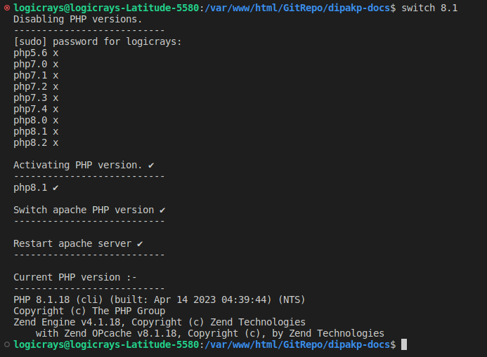

Switch Between Multiple PHP Versions
=====================================

This guide shows you how to switch between multiple PHP versions on Ubuntu Linux systems using Apache web server.

Overview
--------

When working on different projects that require different PHP versions, you need the ability to switch between PHP versions easily. This guide covers:

- Manual switching between specific PHP versions
- Automated switching using a shell script
- Managing PHP versions for Apache and CLI

**Reference**: https://ostechnix.com/how-to-switch-between-multiple-php-versions-in-ubuntu/

Prerequisites
-------------

Before switching PHP versions, ensure you have:

- Multiple PHP versions installed on your system
- Apache web server installed
- Root or sudo access

Manual PHP Version Switching
-----------------------------

Switch From PHP 7.4 to PHP 8.1
~~~~~~~~~~~~~~~~~~~~~~~~~~~~~~~

Follow these steps to switch from PHP 7.4 to PHP 8.1:

#. **Disable the current PHP version (7.4) for Apache**:

    .. code-block:: bash

        sudo a2dismod php7.4

#. **Enable the target PHP version (8.1) for Apache**:

    .. code-block:: bash

        sudo a2enmod php8.1

#. **Set PHP 8.1 as the default CLI version**:

    .. code-block:: bash

        sudo update-alternatives --set php /usr/bin/php8.1

#. **Verify the installed PHP versions** (optional):

    .. code-block:: bash

        sudo update-alternatives --config php

    This command shows all installed PHP versions and allows you to select the default.

#. **Restart Apache to apply changes**:

    .. code-block:: bash

        sudo systemctl restart apache2

#. **Verify the switch**:

    .. code-block:: bash

        php -v

    This should show PHP 8.1 as the active version.

Switch From PHP 8.1 to PHP 7.4
~~~~~~~~~~~~~~~~~~~~~~~~~~~~~~~

To switch back from PHP 8.1 to PHP 7.4, follow these steps:

#. **Disable PHP 8.1 for Apache**:

    .. code-block:: bash

        sudo a2dismod php8.1

#. **Enable PHP 7.4 for Apache**:

    .. code-block:: bash

        sudo a2enmod php7.4

#. **Set PHP 7.4 as the default CLI version**:

    .. code-block:: bash

        sudo update-alternatives --set php /usr/bin/php7.4

#. **Verify the installed PHP versions** (optional):

    .. code-block:: bash

        sudo update-alternatives --config php

#. **Restart Apache to apply changes**:

    .. code-block:: bash

        sudo systemctl restart apache2

#. **Verify the switch**:

    .. code-block:: bash

        php -v

    This should now show PHP 7.4 as the active version.

Troubleshooting
~~~~~~~~~~~~~~~

**Error: Module does not exist**

If you encounter an error like ``ERROR: Module php8.1 does not exist!``, it means the Apache PHP module is not installed. Install it with:

.. code-block:: bash

    sudo apt-get install libapache2-mod-php8.1

Replace ``php8.1`` with the version you need (e.g., ``php7.4``, ``php8.0``, ``php8.2``, ``php8.3``, ``php8.4``).

Automated PHP Switching Using Shell Script
-------------------------------------------

For frequent PHP version switching, you can use an automated shell script that simplifies the process.

**Reference**: https://github.com/vinugawade/s-php/blob/master/s-php

Installation Steps
~~~~~~~~~~~~~~~~~~

#. Create a file named ``switch.sh`` in any location. For example, in ``/var/www/html``:

    .. code-block:: bash

        cd /var/www/html
        nano switch.sh

#. Add the following script content to the file:
    
    .. code-block:: bash

        #!/bin/bash
        # This is a bash script that allows you to switch between different versions of PHP.
        # Reference: https://github.com/vinugawade/s-php/blob/master/s-php

        # s-php script version.
        VERSION="1.0.0"

        # Function to display error/help messages.
        function show_msg() {
        [[ $1 == "invalid" ]] && echo -e "sphp: Invalid argument"
        [[ $1 == "help" ]] && echo "Usage:
        s-php <version> | [options]
        Easily switch PHP versions on Linux.
        Options:
        -h, --help                 display this help and exit
        -v, --version              display s-php script version"

        # Display versions separated by `,`.
        echo -e "\nPHP Versions :-"
        versions=$(printf '%s, ' ${php_ver[*]})
        echo "  ${versions::-2}"
        exit 1
        }

        # Define available PHP versions.
        php_ver=("5.6" "7.0" "7.1" "7.2" "7.3" "7.4" "8.0" "8.1" "8.2" "8.3" "8.4")
        # php_ver=("7.1" "7.2" "7.3" "7.4" "8.0" "8.1" "8.2" "8.3" "8.4")

        # Check input value.
        if [ -z "$1" ]; then
        show_msg invalid # Show invalid input message.
        elif [ $# -gt 1 ]; then
        echo -e "Too many arguments:- $*"
        exit 1
        else
        # Check input and show help message.
        if [[ ($* == "--help") || ($* == "-h") ]]; then
            show_msg help
        fi

        # Check input and script version.
        if [[ ($* == "--version") || ($* == "-v") ]]; then
            echo -e "s-php v${VERSION} \nVisit :- https://vinugawade.github.io/s-php"
            exit 1
        fi

        # Check valid PHP version input.
        if [[ ${php_ver[*]} =~ (^|[[:space:]])"${*}"($|[[:space:]]) ]]; then
            php="php${*}"
            phar="phar${*}"
            echo -e "Disabling PHP versions."
            echo "---------------------------"
            # Disable active PHP of apache.
            for i in "${php_ver[@]}"; do
            sudo a2dismod "php${i}" > /dev/null
            printf 'php%s x \n' "${i}"
            done
        else
            show_msg invalid # Show invalid input message.
        fi

        echo -e "\nActivating PHP version. \u2714"
        echo "---------------------------"
        # Change PHP version of system.
        sudo update-alternatives --set php /usr/bin/"${php}" > /dev/null
        sudo update-alternatives --set phar /usr/bin/"${phar}" > /dev/null
        sudo update-alternatives --set phar.phar /usr/bin/phar."${phar}" > /dev/null
        printf '%s \u2714 \n' "${php}"

        # Check apache server is active or not.
        if pgrep -x apache2 > /dev/null; then
            # Enable PHP version for apache.
            echo -e "\nSwitch apache PHP version \u2714"
            echo "---------------------------"
            sudo a2enmod "${php}" > /dev/null

            # Restart apache server.
            echo -e "\nRestart apache server \u2714"
            echo "---------------------------"
            sudo systemctl restart apache2 > /dev/null
            sudo service apache2 restart > /dev/null
        else
            echo -e "\nApache server not running x"
        fi

        # Print new PHP cli version.
        echo -e "\nCurrent PHP version :-"
        echo "---------------------------"
        php -v
        exit 1
        fi

#. Make the script executable:

    .. code-block:: bash

        sudo chmod u+x switch.sh

#. Move the script to a global location for system-wide access:

    .. code-block:: bash

        sudo mv switch.sh /usr/bin/switch

    This allows you to run the ``switch`` command from anywhere.

Usage
~~~~~

After installation, you can switch PHP versions with a simple command:

**Switch to PHP 8.1**:

.. code-block:: bash

    switch 8.1

**Switch to PHP 7.4**:

.. code-block:: bash

    switch 7.4

**Switch to PHP 8.2**:

.. code-block:: bash

    switch 8.2

**View help**:

.. code-block:: bash

    switch --help

**View script version**:

.. code-block:: bash

    switch --version

Script Output
~~~~~~~~~~~~~

When you run the switch command, you'll see output similar to this:

    PHP version switch command output

The script will:

- Disable all active PHP versions for Apache
- Enable the specified PHP version
- Update system-wide PHP CLI version
- Restart Apache server automatically
- Display the current active PHP version

Features
~~~~~~~~

The automated script provides several advantages:

- **Quick switching**: Single command to switch versions
- **Comprehensive**: Updates both Apache and CLI PHP versions
- **Safe**: Disables all other PHP versions automatically
- **Automatic restart**: Restarts Apache automatically after switching
- **Version verification**: Shows current PHP version after switching
- **Multiple versions supported**: PHP 5.6, 7.0, 7.1, 7.2, 7.3, 7.4, 8.0, 8.1, 8.2, 8.3, 8.4

.. note::
    If you need to add or remove PHP versions from the script, edit the ``php_ver`` array in the script file at ``/usr/bin/switch``.

Best Practices
--------------

Version Management
~~~~~~~~~~~~~~~~~~

- **Test before production**: Always test version switches in development environments first
- **Check compatibility**: Ensure your application supports the target PHP version
- **Document requirements**: Keep track of which projects require which PHP versions
- **Use version control**: Include PHP version requirements in your project documentation

Common Use Cases
~~~~~~~~~~~~~~~~

**Scenario 1: Different Projects**
    If you have Project A requiring PHP 7.4 and Project B requiring PHP 8.1, switch versions as needed:

    .. code-block:: bash

        # Working on Project A
        switch 7.4

        # Working on Project B
        switch 8.1

**Scenario 2: Testing Upgrades**
    When upgrading applications, test with newer PHP versions:

    .. code-block:: bash

        # Current version
        switch 7.4
        # Run tests

        # Test with new version
        switch 8.1
        # Run tests again

**Scenario 3: Debugging**
    Switch to specific versions to reproduce or debug issues:

    .. code-block:: bash

        switch 8.0  # If issue reported on PHP 8.0

Additional Commands
-------------------

Check Current PHP Version
~~~~~~~~~~~~~~~~~~~~~~~~~

.. code-block:: bash

    # CLI version
    php -v

    # Apache version (via phpinfo)
    # Create a file: /var/www/html/info.php with content: <?php phpinfo(); ?>
    # Then access: http://localhost/info.php

List Installed PHP Versions
~~~~~~~~~~~~~~~~~~~~~~~~~~~~

.. code-block:: bash

    # List all installed PHP packages
    dpkg -l | grep php | grep -v php-common

Install Additional PHP Versions
~~~~~~~~~~~~~~~~~~~~~~~~~~~~~~~~

.. code-block:: bash

    # Add PHP repository (if not already added)
    sudo add-apt-repository ppa:ondrej/php
    sudo apt update

    # Install specific PHP version
    sudo apt install php8.2 php8.2-cli php8.2-common libapache2-mod-php8.2

.. tip::
    Always keep your PHP installations updated with security patches. Use ``sudo apt update && sudo apt upgrade`` regularly.
