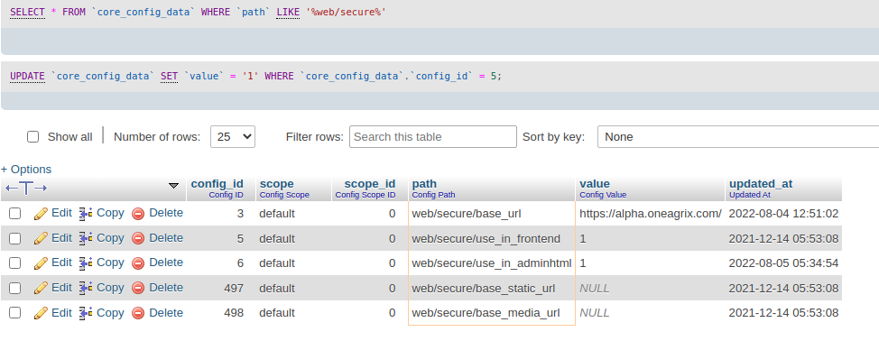

Apache Virtual Host Configuration Guide
========================================

This comprehensive guide covers Apache virtual host configuration on Linux systems, enabling you to host multiple websites on a single server.

.. contents:: Table of Contents
   :local:
   :depth: 2

Introduction
------------

What is a Virtual Host?
~~~~~~~~~~~~~~~~~~~~~~~

A Virtual Host is an Apache configuration that allows you to host multiple domains/websites on a single server. Apache uses the ``ServerName`` and ``ServerAlias`` directives to distinguish between different sites.

**Benefits of Virtual Hosts:**

- Host multiple websites on one server
- Efficient resource utilization
- Separate configuration for each site
- Individual log files per domain
- Cost-effective hosting solution

**Types of Virtual Hosts:**

- **Name-based:** Multiple domains on one IP address (most common)
- **IP-based:** Each domain has its own IP address
- **Port-based:** Different ports for different sites

Prerequisites
-------------

Before configuring virtual hosts, ensure you have:

.. code-block:: bash

    # Check if Apache is installed
    apache2 -v

    # Install Apache if not present
    sudo apt-get update
    sudo apt-get install apache2

**Required:**

- Apache2 web server installed
- Root or sudo access
- Domain name (or local hostname for testing)
- Basic understanding of Linux commands

**Optional (Recommended for Production):**

- DNS records configured (for production environments)
- SSL certificate (for HTTPS - optional but recommended)
- Firewall configured to allow HTTP/HTTPS traffic

Understanding Apache Directory Structure
-----------------------------------------

Key directories and files:

.. code-block:: text

    /etc/apache2/
    ├── apache2.conf              # Main configuration file
    ├── sites-available/          # Virtual host configurations (disabled)
    │   ├── 000-default.conf      # Default HTTP virtual host
    │   └── default-ssl.conf      # Default HTTPS virtual host
    ├── sites-enabled/            # Active virtual hosts (symlinks)
    ├── mods-available/           # Available Apache modules
    ├── mods-enabled/             # Enabled Apache modules
    └── conf-available/           # Additional configurations

Basic Virtual Host Configuration
---------------------------------

Method 1: Standard Virtual Host File
~~~~~~~~~~~~~~~~~~~~~~~~~~~~~~~~~~~~~

**Step 1: Create Virtual Host Configuration**

Create a new configuration file in ``sites-available``:

.. code-block:: bash

    sudo nano /etc/apache2/sites-available/example.com.conf

**Step 2: Add Virtual Host Configuration**

.. code-block:: apache
   :caption: /etc/apache2/sites-available/example.com.conf

    <VirtualHost *:80>
        # Domain configuration
        ServerName example.com
        ServerAlias www.example.com
        ServerAdmin admin@example.com

        # Document root (where your website files are located)
        DocumentRoot /var/www/html/example.com/public

        # Directory permissions
        <Directory /var/www/html/example.com/public>
            Options Indexes FollowSymLinks
            AllowOverride All
            Require all granted
        </Directory>

        # Log files
        ErrorLog ${APACHE_LOG_DIR}/example.com-error.log
        CustomLog ${APACHE_LOG_DIR}/example.com-access.log combined
    </VirtualHost>

**Step 3: Create Document Root Directory**

.. code-block:: bash

    # Create directory structure
    sudo mkdir -p /var/www/html/example.com/public

    # Set proper ownership
    sudo chown -R $USER:$USER /var/www/html/example.com/public

    # Set proper permissions
    sudo chmod -R 755 /var/www/html/example.com

**Step 4: Create Test Page**

.. code-block:: bash

    echo "<h1>Welcome to example.com</h1>" | sudo tee /var/www/html/example.com/public/index.html

**Step 5: Enable Virtual Host**

.. code-block:: bash

    # Enable the site
    sudo a2ensite example.com.conf

    # Test Apache configuration
    sudo apache2ctl configtest

    # Reload Apache
    sudo systemctl reload apache2

**Step 6: Configure Local Testing (Optional)**

If testing locally without DNS:

.. code-block:: bash

    # Edit hosts file
    sudo nano /etc/hosts

    # Add this line
    127.0.0.1  example.com www.example.com

Method 2: Include Configuration from Project Directory
~~~~~~~~~~~~~~~~~~~~~~~~~~~~~~~~~~~~~~~~~~~~~~~~~~~~~~~

This method keeps configuration files within your project directory.

**Step 1: Create Virtual Host Configuration in Project**

.. code-block:: bash

    sudo nano /var/www/html/myproject/vhost.conf

**Step 2: Add Configuration**

.. code-block:: apache
   :caption: /var/www/html/myproject/vhost.conf

    <VirtualHost *:80>
        ServerName myproject.local
        ServerAlias www.myproject.local
        ServerAdmin webmaster@localhost
        DocumentRoot /var/www/html/myproject/public

        <Directory /var/www/html/myproject/public>
            Options Indexes FollowSymLinks MultiViews
            AllowOverride All
            Require all granted
        </Directory>

        ErrorLog ${APACHE_LOG_DIR}/myproject-error.log
        CustomLog ${APACHE_LOG_DIR}/myproject-access.log combined
    </VirtualHost>

**Step 3: Include in Main Configuration**

.. code-block:: bash

    sudo nano /etc/apache2/sites-available/000-default.conf

Add at the bottom:

.. code-block:: apache

    # Include project virtual host
    Include /var/www/html/myproject/vhost.conf

**Step 4: Reload Apache**

.. code-block:: bash

    sudo apache2ctl configtest
    sudo systemctl reload apache2

Magento-Specific Virtual Host Configuration
--------------------------------------------

For Magento applications, special configuration is required.

Step 1: Create Virtual Host Configuration
~~~~~~~~~~~~~~~~~~~~~~~~~~~~~~~~~~~~~~~~~~

Create the configuration file in your Magento root:

.. code-block:: bash

    sudo nano /var/www/html/magento/proxy-le-ssl.conf

Step 2: Add Magento Virtual Host Configuration
~~~~~~~~~~~~~~~~~~~~~~~~~~~~~~~~~~~~~~~~~~~~~~~

.. code-block:: apache
   :caption: /var/www/html/magento/proxy-le-ssl.conf

    <VirtualHost *:80>
        # Server configuration
        ServerName alpha.oneagrix.com
        ServerAlias www.alpha.oneagrix.com
        ServerAdmin webmaster@localhost

        # Magento requires DocumentRoot to point to pub directory
        DocumentRoot /var/www/html/magento/pub

        # Directory configuration for Magento
        <Directory /var/www/html/magento/pub>
            Options Indexes FollowSymLinks MultiViews
            AllowOverride All
            Require all granted
        </Directory>

        # Logging
        ErrorLog ${APACHE_LOG_DIR}/magento-error.log
        CustomLog ${APACHE_LOG_DIR}/magento-access.log combined

        # Optional: Enable rewrite module for Magento
        # RewriteEngine On
    </VirtualHost>
Step 3: Include Configuration in Apache
~~~~~~~~~~~~~~~~~~~~~~~~~~~~~~~~~~~~~~~~

Open the default Apache configuration file:

.. code-block:: bash

    sudo nano /etc/apache2/sites-available/000-default.conf

Add the include directive at the bottom of the file:

.. code-block:: apache

    # Include Magento virtual host configuration
    Include /var/www/html/magento/proxy-le-ssl.conf

Step 4: Enable Required Apache Modules
~~~~~~~~~~~~~~~~~~~~~~~~~~~~~~~~~~~~~~~

Magento requires specific Apache modules:

.. code-block:: bash

    # Enable rewrite module (required for URL rewriting)
    sudo a2enmod rewrite

    # Enable headers module (required)
    sudo a2enmod headers

    # Test configuration
    sudo apache2ctl configtest

    # Restart Apache
    sudo systemctl restart apache2

.. note::
   **SSL module** is optional and only needed if you're configuring HTTPS:

   .. code-block:: bash

       # Enable SSL module (optional - only for HTTPS)
       sudo a2enmod ssl
       sudo systemctl restart apache2

Step 5: Verify Configuration
~~~~~~~~~~~~~~~~~~~~~~~~~~~~~

Test if the virtual host is working:

.. code-block:: bash

    # Check if site is accessible
    curl -I http://alpha.oneagrix.com

    # View Apache error logs if issues occur
    sudo tail -f /var/log/apache2/magento-error.log

Step 6: Fix Magento HTTPS Issues (Optional)
~~~~~~~~~~~~~~~~~~~~~~~~~~~~~~~~~~~~~~~~~~~~

.. note::
   This step is only required if you're using HTTPS/SSL with Magento. Skip this section if you're using HTTP only.

If Magento admin or frontend is not working properly with HTTPS, check the database configuration.

**Run SQL Query to Check HTTPS Settings:**

.. code-block:: sql

    SELECT * FROM `core_config_data` WHERE `path` LIKE '%web/secure%';

    SQL query to check secure web configuration

**Update HTTPS Settings:**

If ``web/secure/use_in_frontend`` or ``web/secure/use_in_adminhtml`` is set to ``0``, update it to ``1``:

.. code-block:: sql

    -- Enable HTTPS for frontend
    UPDATE `core_config_data`
    SET `value` = '1'
    WHERE `path` = 'web/secure/use_in_frontend';

    -- Enable HTTPS for admin
    UPDATE `core_config_data`
    SET `value` = '1'
    WHERE `path` = 'web/secure/use_in_adminhtml';

**Alternative: Using Magento CLI**

.. code-block:: bash

    # Enable HTTPS for frontend
    php bin/magento config:set web/secure/use_in_frontend 1

    # Enable HTTPS for admin
    php bin/magento config:set web/secure/use_in_adminhtml 1

    # Clear cache
    php bin/magento cache:flush

**Reference:** `Magento HTTPS Configuration Guide <https://magento.stackexchange.com/questions/162392/https-not-working-on-magento2-backend/201830#201830>`_

SSL/HTTPS Virtual Host Configuration (Optional)
------------------------------------------------

.. important::
   This section is **optional**. SSL/HTTPS is recommended for production environments but not required for development or local testing.

**When to use SSL/HTTPS:**

- Production websites (highly recommended)
- E-commerce sites (required for secure transactions)
- Sites handling sensitive user data
- To improve SEO rankings
- To meet compliance requirements (PCI DSS, GDPR, etc.)

**When SSL is not necessary:**

- Local development environments
- Internal testing servers
- Non-production environments

Configuring HTTPS with Let's Encrypt
~~~~~~~~~~~~~~~~~~~~~~~~~~~~~~~~~~~~~

**Step 1: Install Certbot**

.. code-block:: bash

    # Install Certbot and Apache plugin
    sudo apt-get update
    sudo apt-get install certbot python3-certbot-apache

**Step 2: Obtain SSL Certificate**

.. code-block:: bash

    # Get certificate and auto-configure Apache
    sudo certbot --apache -d example.com -d www.example.com

    # Follow the prompts to configure HTTPS

**Step 3: Verify SSL Configuration**

Certbot automatically creates an SSL virtual host configuration. Check the file:

.. code-block:: bash

    sudo nano /etc/apache2/sites-available/example.com-le-ssl.conf

Manual SSL Virtual Host Configuration
~~~~~~~~~~~~~~~~~~~~~~~~~~~~~~~~~~~~~~

If you have an SSL certificate from another provider:

.. code-block:: apache
   :caption: /etc/apache2/sites-available/example.com-ssl.conf

    <VirtualHost *:443>
        ServerName example.com
        ServerAlias www.example.com
        ServerAdmin admin@example.com
        DocumentRoot /var/www/html/example.com/public

        # SSL Configuration
        SSLEngine on
        SSLCertificateFile /etc/ssl/certs/example.com.crt
        SSLCertificateKeyFile /etc/ssl/private/example.com.key
        SSLCertificateChainFile /etc/ssl/certs/example.com.ca-bundle

        <Directory /var/www/html/example.com/public>
            Options Indexes FollowSymLinks
            AllowOverride All
            Require all granted
        </Directory>

        ErrorLog ${APACHE_LOG_DIR}/example.com-ssl-error.log
        CustomLog ${APACHE_LOG_DIR}/example.com-ssl-access.log combined
    </VirtualHost>

HTTP to HTTPS Redirect
~~~~~~~~~~~~~~~~~~~~~~

Force all HTTP traffic to HTTPS:

.. code-block:: apache
   :caption: Update HTTP VirtualHost

    <VirtualHost *:80>
        ServerName example.com
        ServerAlias www.example.com

        # Redirect all HTTP to HTTPS
        RewriteEngine On
        RewriteCond %{HTTPS} off
        RewriteRule ^(.*)$ https://%{HTTP_HOST}$1 [R=301,L]
    </VirtualHost>

Enable SSL module and the site:

.. code-block:: bash

    # Enable SSL module (if not already enabled)
    sudo a2enmod ssl

    # Enable the SSL virtual host
    sudo a2ensite example.com-ssl.conf

    # Test configuration
    sudo apache2ctl configtest

    # Reload Apache
    sudo systemctl reload apache2

Common Apache Commands
----------------------

Managing Virtual Hosts
~~~~~~~~~~~~~~~~~~~~~~~

.. code-block:: bash

    # Enable a virtual host
    sudo a2ensite example.com.conf

    # Disable a virtual host
    sudo a2dissite example.com.conf

    # List enabled sites
    ls -la /etc/apache2/sites-enabled/

    # List available sites
    ls -la /etc/apache2/sites-available/

Managing Apache Modules
~~~~~~~~~~~~~~~~~~~~~~~~

.. code-block:: bash

    # Enable a module
    sudo a2enmod rewrite

    # Disable a module
    sudo a2dismod rewrite

    # List enabled modules
    apache2ctl -M

Apache Service Management
~~~~~~~~~~~~~~~~~~~~~~~~~

.. code-block:: bash

    # Start Apache
    sudo systemctl start apache2

    # Stop Apache
    sudo systemctl stop apache2

    # Restart Apache
    sudo systemctl restart apache2

    # Reload Apache (graceful restart)
    sudo systemctl reload apache2

    # Check Apache status
    sudo systemctl status apache2

    # Enable Apache on boot
    sudo systemctl enable apache2

Testing and Validation
~~~~~~~~~~~~~~~~~~~~~~~

.. code-block:: bash

    # Test Apache configuration syntax
    sudo apache2ctl configtest

    # Test specific configuration file
    sudo apache2ctl -t -D DUMP_VHOSTS

    # Show loaded virtual hosts
    sudo apache2ctl -S

Troubleshooting
---------------

Common Issues and Solutions
~~~~~~~~~~~~~~~~~~~~~~~~~~~

**Issue: "Syntax error on line X"**

.. code-block:: bash

    # Check configuration syntax
    sudo apache2ctl configtest

    # View detailed error
    sudo apache2ctl -t

**Issue: Virtual host not working**

.. code-block:: bash

    # Check if site is enabled
    ls -la /etc/apache2/sites-enabled/ | grep example.com

    # Enable the site if not enabled
    sudo a2ensite example.com.conf
    sudo systemctl reload apache2

**Issue: Permission denied errors**

.. code-block:: bash

    # Set correct ownership
    sudo chown -R www-data:www-data /var/www/html/example.com

    # Set correct permissions
    sudo chmod -R 755 /var/www/html/example.com

**Issue: Port already in use**

.. code-block:: bash

    # Check what's using port 80
    sudo netstat -tulpn | grep :80

    # Or use ss command
    sudo ss -tulpn | grep :80

    # Check Apache is not running multiple times
    ps aux | grep apache2

**Issue: Domain not resolving**

.. code-block:: bash

    # For local testing, add to /etc/hosts
    sudo nano /etc/hosts
    # Add: 127.0.0.1  example.com www.example.com

    # For production, check DNS records
    nslookup example.com
    dig example.com

**Issue: 403 Forbidden error**

Check directory permissions and Apache configuration:

.. code-block:: apache

    <Directory /var/www/html/example.com/public>
        Options Indexes FollowSymLinks
        AllowOverride All
        Require all granted  # Make sure this is set
    </Directory>

Viewing Logs
~~~~~~~~~~~~

.. code-block:: bash

    # View Apache error log
    sudo tail -f /var/log/apache2/error.log

    # View site-specific error log
    sudo tail -f /var/log/apache2/example.com-error.log

    # View access log
    sudo tail -f /var/log/apache2/example.com-access.log

    # View all logs
    sudo tail -f /var/log/apache2/*.log

Performance Optimization
------------------------

Enable Compression
~~~~~~~~~~~~~~~~~~

.. code-block:: bash

    # Enable mod_deflate
    sudo a2enmod deflate
    sudo systemctl reload apache2

Enable Caching
~~~~~~~~~~~~~~

.. code-block:: bash

    # Enable caching modules
    sudo a2enmod expires
    sudo a2enmod headers
    sudo systemctl reload apache2

Add to your virtual host:

.. code-block:: apache

    # Enable browser caching
    <IfModule mod_expires.c>
        ExpiresActive On
        ExpiresByType image/jpg "access plus 1 year"
        ExpiresByType image/jpeg "access plus 1 year"
        ExpiresByType image/gif "access plus 1 year"
        ExpiresByType image/png "access plus 1 year"
        ExpiresByType text/css "access plus 1 month"
        ExpiresByType application/javascript "access plus 1 month"
    </IfModule>

Security Best Practices
-----------------------

Disable Directory Listing
~~~~~~~~~~~~~~~~~~~~~~~~~~

.. code-block:: apache

    <Directory /var/www/html/example.com/public>
        Options -Indexes FollowSymLinks
        AllowOverride All
        Require all granted
    </Directory>

Hide Apache Version
~~~~~~~~~~~~~~~~~~~

.. code-block:: bash

    sudo nano /etc/apache2/conf-available/security.conf

Update:

.. code-block:: apache

    ServerTokens Prod
    ServerSignature Off

Enable and reload:

.. code-block:: bash

    sudo systemctl reload apache2

Limit Request Size
~~~~~~~~~~~~~~~~~~

.. code-block:: apache

    # Limit request body size to 10MB
    LimitRequestBody 10485760

Conclusion
----------

You now have a comprehensive understanding of Apache virtual host configuration. This guide covered:

- Basic virtual host setup
- Magento-specific configuration
- SSL/HTTPS configuration
- Common commands and troubleshooting
- Security and performance optimization

**Next Steps:**

- Configure SSL certificates for production
- Set up monitoring and log rotation
- Implement security hardening
- Configure caching and optimization
- Set up automated backups

**Additional Resources:**

- `Apache Virtual Host Documentation <https://httpd.apache.org/docs/2.4/vhosts/>`_
- `Apache Configuration Guide <https://httpd.apache.org/docs/2.4/configuring.html>`_
- `Let's Encrypt Documentation <https://letsencrypt.org/docs/>`_
- `Magento DevDocs <https://devdocs.magento.com/>`_
