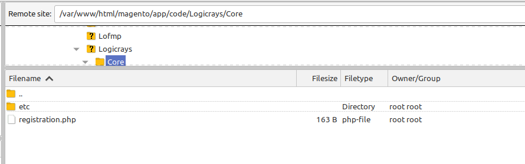

Magento 2: Module Installation
================================

This guide covers the various methods to install Magento 2 modules, including Composer installation, manual installation, and module management.

.. contents:: Table of Contents
   :local:
   :depth: 2

Overview
--------

Magento 2 modules can be installed using several methods:

- **Composer** (Recommended) - For modules available on Packagist or private repositories
- **Manual Installation** - For custom modules or when Composer is not available
- **Marketplace Installation** - For modules purchased from Magento Marketplace
- **Git Submodules** - For version-controlled development

Installation Methods
--------------------

Method 1: Composer Installation
~~~~~~~~~~~~~~~~~~~~~~~~~~~~~~~~

Composer is the recommended method for installing Magento 2 modules as it handles dependencies automatically.

**For Packagist Modules**

.. code-block:: bash

    # Navigate to Magento root
    cd /var/www/html/magento2

    # Install the module
    composer require vendor/module-name

    # Enable the module
    php bin/magento module:enable Vendor_ModuleName

    # Run setup upgrade
    php bin/magento setup:upgrade

    # Deploy static content (production mode)
    php bin/magento setup:static-content:deploy -f

    # Clear cache
    php bin/magento cache:flush

**For Private/Custom Repository**

Add the repository to ``composer.json``:

.. code-block:: json

    {
        "repositories": [
            {
                "type": "vcs",
                "url": "https://github.com/vendor/module-name.git"
            }
        ]
    }

Then install:

.. code-block:: bash

    composer require vendor/module-name

**Install Specific Version**

.. code-block:: bash

    composer require vendor/module-name:1.2.3

Method 2: Manual Installation
~~~~~~~~~~~~~~~~~~~~~~~~~~~~~~

Manual installation is useful for custom modules or when Composer is not available.

**Step 1: Create Module Directory**

.. code-block:: bash

    mkdir -p app/code/Vendor/ModuleName

**Step 2: Copy Module Files**

Copy all module files to the created directory:

.. code-block:: bash

    cp -r /path/to/module/* app/code/Vendor/ModuleName/

**Step 3: Verify Module Structure**

Ensure the module has the required files:

.. code-block:: text

    app/code/Vendor/ModuleName/
    ├── registration.php
    ├── etc/
    │   └── module.xml
    ├── Model/
    ├── Controller/
    ├── Block/
    └── view/

**Step 4: Enable and Install**

.. code-block:: bash

    # Check if module is recognized
    php bin/magento module:status

    # Enable the module
    php bin/magento module:enable Vendor_ModuleName

    # Run setup upgrade
    php bin/magento setup:upgrade

    # Compile (production mode)
    php bin/magento setup:di:compile

    # Deploy static content
    php bin/magento setup:static-content:deploy -f

    # Clear cache
    php bin/magento cache:flush

Method 3: Marketplace Installation
~~~~~~~~~~~~~~~~~~~~~~~~~~~~~~~~~~~

**Step 1: Purchase and Get Keys**

1. Purchase the module from Magento Marketplace
2. Go to My Profile > My Products > Access Keys
3. Generate or use existing access keys

**Step 2: Configure Authentication**

.. code-block:: bash

    composer config --global --auth http-basic.repo.magento.com <public_key> <private_key>

**Step 3: Install Module**

.. code-block:: bash

    # Install via Composer
    composer require vendor/module-name

    # Enable and upgrade
    php bin/magento module:enable Vendor_ModuleName
    php bin/magento setup:upgrade
    php bin/magento setup:static-content:deploy -f
    php bin/magento cache:flush

Method 4: Git Submodule Installation
~~~~~~~~~~~~~~~~~~~~~~~~~~~~~~~~~~~~~

For development environments with version control:

.. code-block:: bash

    # Add as submodule
    git submodule add https://github.com/vendor/module-name.git app/code/Vendor/ModuleName

    # Initialize submodule
    git submodule init
    git submodule update

    # Enable module
    php bin/magento module:enable Vendor_ModuleName
    php bin/magento setup:upgrade

Module Management Commands
--------------------------

Essential CLI Commands
~~~~~~~~~~~~~~~~~~~~~~

**List All Modules**

.. code-block:: bash

    # List all modules with status
    php bin/magento module:status

    # List enabled modules only
    php bin/magento module:status --enabled

    # List disabled modules only
    php bin/magento module:status --disabled

**Enable Module**

.. code-block:: bash

    # Enable single module
    php bin/magento module:enable Vendor_ModuleName

    # Enable multiple modules
    php bin/magento module:enable Vendor_Module1 Vendor_Module2

    # Enable all modules
    php bin/magento module:enable --all

**Disable Module**

.. code-block:: bash

    # Disable single module
    php bin/magento module:disable Vendor_ModuleName

    # Disable multiple modules
    php bin/magento module:disable Vendor_Module1 Vendor_Module2

    # Clear cache after disabling
    php bin/magento cache:flush

**Uninstall Module**

.. code-block:: bash

    # Uninstall via Composer (if installed via Composer)
    php bin/magento module:uninstall Vendor_ModuleName

    # With data removal
    php bin/magento module:uninstall --remove-data Vendor_ModuleName

    # With backup
    php bin/magento module:uninstall --backup-code --backup-media --backup-db Vendor_ModuleName

    # Remove via Composer
    composer remove vendor/module-name

Setup Commands
~~~~~~~~~~~~~~

**Upgrade Database Schema**

.. code-block:: bash

    php bin/magento setup:upgrade

**Compile Dependency Injection**

.. code-block:: bash

    # Required in production mode
    php bin/magento setup:di:compile

**Deploy Static Content**

.. code-block:: bash

    # Deploy for all locales
    php bin/magento setup:static-content:deploy

    # Deploy for specific locale
    php bin/magento setup:static-content:deploy en_US

    # Force deploy (override existing)
    php bin/magento setup:static-content:deploy -f

    # Deploy for specific theme
    php bin/magento setup:static-content:deploy --theme=Vendor/theme

**Clear Cache**

.. code-block:: bash

    # Flush all cache
    php bin/magento cache:flush

    # Clean cache
    php bin/magento cache:clean

    # Disable cache
    php bin/magento cache:disable

    # Enable cache
    php bin/magento cache:enable

Module Dependencies
-------------------

Checking Dependencies
~~~~~~~~~~~~~~~~~~~~~

Use n98-magerun2 to check module dependencies:

.. code-block:: bash

    # Check soft and hard dependencies
    mage2run dev:module:detect-composer-dependencies Vendor_ModuleName

Module Load Order
~~~~~~~~~~~~~~~~~

Magento loads modules based on dependencies defined in ``module.xml``:

.. code-block:: xml
   :caption: etc/module.xml

    <?xml version="1.0"?>
    <config xmlns:xsi="http://www.w3.org/2001/XMLSchema-instance"
            xsi:noNamespaceSchemaLocation="urn:magento:framework:Module/etc/module.xsd">
        <module name="Vendor_ModuleName" setup_version="1.0.0">
            <sequence>
                <module name="Magento_Catalog"/>
                <module name="Magento_Customer"/>
            </sequence>
        </module>
    </config>

Troubleshooting
---------------

Common Issues
~~~~~~~~~~~~~

**Module Not Found**

.. code-block:: bash

    # Clear generated files
    rm -rf generated/code generated/metadata var/cache var/page_cache

    # Regenerate
    php bin/magento setup:upgrade

**Class Not Found Errors**

.. code-block:: bash

    # Regenerate autoloader
    composer dump-autoload

    # Recompile DI
    php bin/magento setup:di:compile

**Static Content Issues**

.. code-block:: bash

    # Remove old static files
    rm -rf pub/static/* var/view_preprocessed/*

    # Redeploy
    php bin/magento setup:static-content:deploy -f

**Database Schema Issues**

.. code-block:: bash

    # Check setup version
    php bin/magento setup:db:status

    # Upgrade schema
    php bin/magento setup:upgrade

**Permission Issues**

.. code-block:: bash

    # Fix permissions
    find var generated vendor pub/static pub/media app/etc -type f -exec chmod g+w {} +
    find var generated vendor pub/static pub/media app/etc -type d -exec chmod g+ws {} +
    chown -R :www-data .
    chmod u+x bin/magento

Module Conflicts
~~~~~~~~~~~~~~~~

Check for module conflicts:

.. code-block:: bash

    # Check module status
    php bin/magento module:status

    # Review logs
    tail -f var/log/system.log
    tail -f var/log/exception.log

Best Practices
--------------

Installation Best Practices
~~~~~~~~~~~~~~~~~~~~~~~~~~~~

1. **Always Backup Before Installation**

   .. code-block:: bash

       # Backup database
       php bin/magento setup:backup --db

       # Backup code and media
       php bin/magento setup:backup --code --media

2. **Test in Development First**
   - Never install directly in production
   - Test all functionality thoroughly
   - Check for conflicts with existing modules

3. **Use Composer When Possible**
   - Better dependency management
   - Easier updates
   - Version control

4. **Enable Maintenance Mode**

   .. code-block:: bash

       # Before installation
       php bin/magento maintenance:enable

       # After installation
       php bin/magento maintenance:disable

5. **Monitor Logs During Installation**

   .. code-block:: bash

       tail -f var/log/system.log var/log/exception.log

Development Mode vs Production Mode
~~~~~~~~~~~~~~~~~~~~~~~~~~~~~~~~~~~~

**Development Mode**

.. code-block:: bash

    # Set developer mode
    php bin/magento deploy:mode:set developer

    # No need to compile or deploy static content
    # Changes reflect immediately

**Production Mode**

.. code-block:: bash

    # Set production mode
    php bin/magento deploy:mode:set production

    # Required steps after module installation
    php bin/magento setup:di:compile
    php bin/magento setup:static-content:deploy -f

Version Control
~~~~~~~~~~~~~~~

**Add to .gitignore**

.. code-block:: text

    # Don't commit vendor modules installed via Composer
    /vendor/
    /app/code/Vendor/ModuleName/

**Commit composer.json Changes**

.. code-block:: bash

    git add composer.json composer.lock
    git commit -m "Add new module: Vendor_ModuleName"

Module Update Process
---------------------

Updating via Composer
~~~~~~~~~~~~~~~~~~~~~

.. code-block:: bash

    # Update specific module
    composer update vendor/module-name

    # Update all modules
    composer update

    # After update
    php bin/magento setup:upgrade
    php bin/magento setup:di:compile
    php bin/magento setup:static-content:deploy -f
    php bin/magento cache:flush

Manual Update
~~~~~~~~~~~~~

1. Backup current module
2. Replace module files
3. Run setup upgrade
4. Clear cache and regenerate

.. code-block:: bash

    # Backup
    cp -r app/code/Vendor/ModuleName app/code/Vendor/ModuleName.backup

    # Update files
    cp -r /path/to/new/module/* app/code/Vendor/ModuleName/

    # Upgrade
    php bin/magento setup:upgrade
    php bin/magento cache:flush

Security Considerations
-----------------------

Module Verification
~~~~~~~~~~~~~~~~~~~

1. **Check Module Source**
   - Only install from trusted sources
   - Verify marketplace ratings and reviews
   - Check module permissions and access

2. **Review Code**
   - Check for suspicious code patterns
   - Review database operations
   - Verify file permissions requirements

3. **Test Thoroughly**
   - Test in isolated environment
   - Check for security vulnerabilities
   - Verify data handling

4. **Monitor After Installation**
   - Check logs for unusual activity
   - Monitor performance
   - Review admin access logs

Quick Reference
---------------

Complete Installation Sequence
~~~~~~~~~~~~~~~~~~~~~~~~~~~~~~~

.. code-block:: bash

    # 1. Backup (optional but recommended)
    php bin/magento setup:backup --db

    # 2. Enable maintenance mode
    php bin/magento maintenance:enable

    # 3. Install module (choose one method)
    composer require vendor/module-name
    # OR manually copy to app/code/Vendor/ModuleName

    # 4. Enable module
    php bin/magento module:enable Vendor_ModuleName

    # 5. Run setup upgrade
    php bin/magento setup:upgrade

    # 6. Compile (production mode only)
    php bin/magento setup:di:compile

    # 7. Deploy static content (production mode only)
    php bin/magento setup:static-content:deploy -f

    # 8. Clear cache
    php bin/magento cache:flush

    # 9. Disable maintenance mode
    php bin/magento maintenance:disable

Common Commands Summary
~~~~~~~~~~~~~~~~~~~~~~~

.. list-table::
   :header-rows: 1
   :widths: 40 60

   * - Command
     - Description
   * - ``composer require vendor/module``
     - Install via Composer
   * - ``module:enable Vendor_Module``
     - Enable module
   * - ``module:disable Vendor_Module``
     - Disable module
   * - ``module:uninstall Vendor_Module``
     - Uninstall module
   * - ``module:status``
     - List all modules
   * - ``setup:upgrade``
     - Upgrade database schema
   * - ``setup:di:compile``
     - Compile dependency injection
   * - ``setup:static-content:deploy``
     - Deploy static content
   * - ``cache:flush``
     - Clear all cache
   * - ``maintenance:enable``
     - Enable maintenance mode

See Also
--------

- :doc:`../magento-installation/index` - Magento 2 installation guide
- :doc:`../n98-magerun2/index` - n98-magerun2 CLI tool
- `Magento DevDocs - Install Extensions <https://experienceleague.adobe.com/docs/commerce-operations/installation-guide/tutorials/extensions.html>`_
