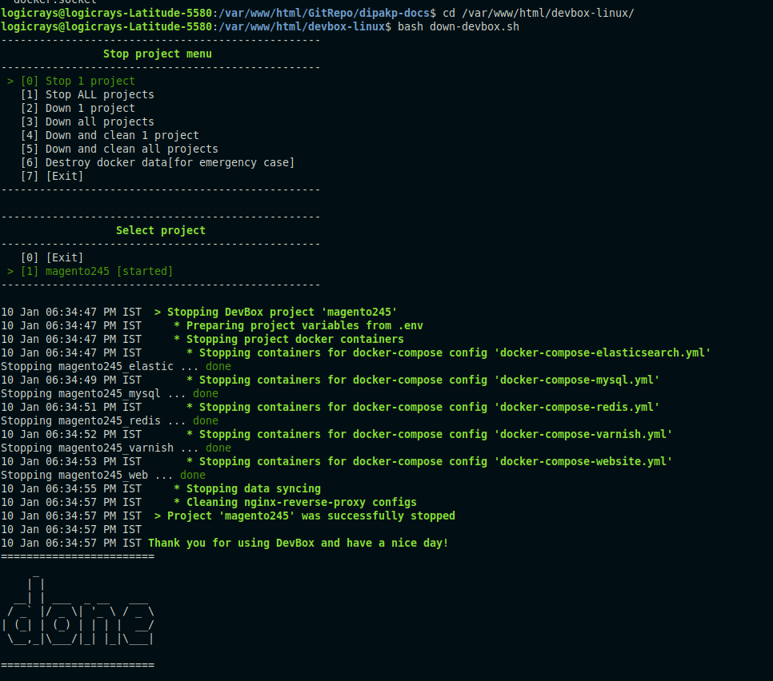
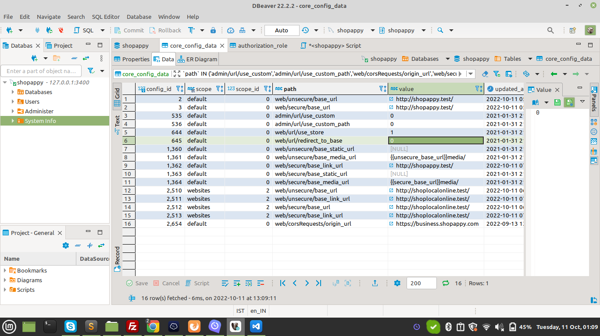
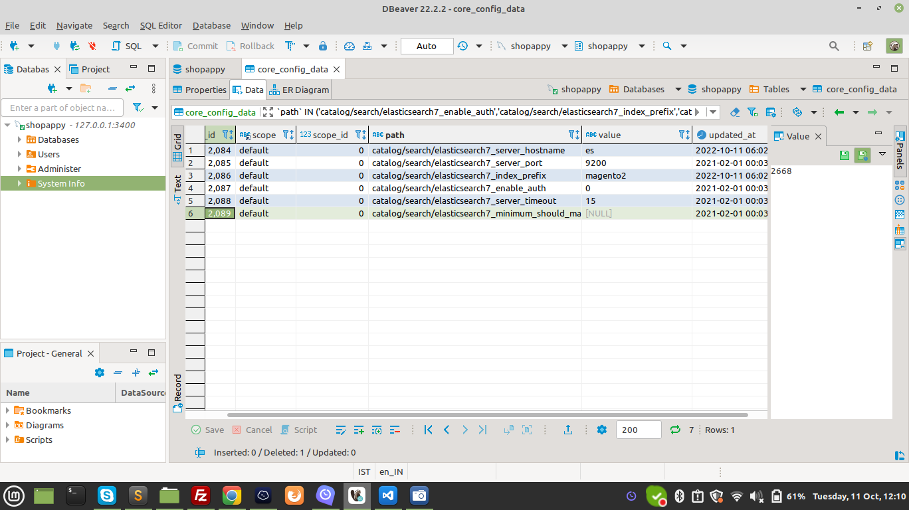
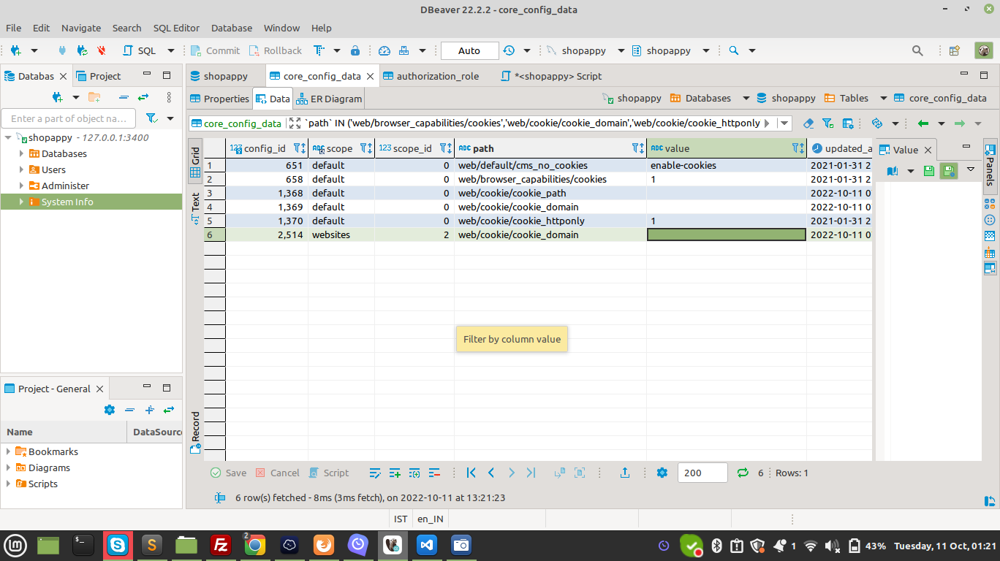
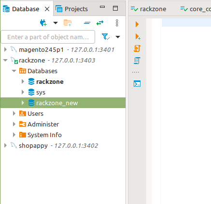

Docker Project Setup Using Devbox-eWave
=======================================

.. contents:: Table of content

Disable Services
----------------

Please stop your local system :guilabel:`elasticsearch`, :guilabel:`apache2` and :guilabel:`mysql` using below commands:

.. code-block:: bash

    sudo service elasticsearch stop
    sudo service apache2 stop
    sudo service mysql stop

If you have installed :guilabel:`varnish` and :guilabel:`redis` on your local system, Please stop these services using the below commands:

.. code-block:: bash

    sudo pkill varnishd
    sudo service redis-server stop

**Reference link for Redis stop service**: https://stackoverflow.com/questions/6910378/how-can-i-stop-redis-server

**Reference link for Varnish stop service**: https://ffwagency.com/insights/blog/start-stop-and-restart-varnish-mac

Install Docker
--------------

Reference link for  `install docker`_ for linux 20.04: 

.. _install docker: https://www.digitalocean.com/community/tutorials/how-to-install-and-use-docker-on-ubuntu-20-04

#. First, update your existing list of packages::
	
	sudo apt update

#. Next, install a few prerequisite packages which let apt use packages over HTTPS::

	sudo apt install apt-transport-https ca-certificates curl software-properties-common

#. Then add the GPG key for the official Docker repository to your system::

	curl -fsSL https://download.docker.com/linux/ubuntu/gpg | sudo apt-key add -

#. Add the Docker repository to APT sources::

	sudo add-apt-repository "deb [arch=amd64] https://download.docker.com/linux/ubuntu focal stable"

#. This will also update our package database with the Docker packages from the newly added repo.
    Make sure you are about to install from the Docker repo instead of the default Ubuntu repo::
	
	apt-cache policy docker-ce

#. Notice that docker-ce is not installed, but the candidate for installation is from the Docker repository for Ubuntu 20.04 (focal).

#. Finally, install Docker::
	
	sudo apt install docker-ce

#. Docker should now be installed, the daemon started, and the process enabled to start on boot. Check that it’s running::
	
	sudo systemctl status docker

Install Ruby
------------

You can `download ruby`_ from official site.

.. _download ruby: https://www.ruby-lang.org/en/documentation/installation/

#. Use below command to install ruby::

    sudo apt-get install ruby-full

#. Check ruby version using below command::

    ruby -v 

Install DBeaver
---------------

You can `download DBeaver`_ from official site.

.. _download DBeaver: https://dbeaver.io/download/

Install Devbox-eWave
--------------------

DevBox is a tool for upping/managing containers & infrastructure on a host machine, enabling users to run any project they want, based on Linux OS containers.

DevBox also enables the creation of flexible server infrastructure based on Docker containers and project configuration.

The DevBox tool is intended not only for upping the project on the local machine only but also for creating the completed environment for developers with all required tools they usually use as xDebug, mailer tools, Blackfire, etc.

The tool helps to deploy projects faster especially for teams and companies which have many projects on development / production stages without additional time costs. It also helps build a clear process for internal development.

Reference link **install DevBox**: https://devbox.ewave.com/#/installation

#. Go to ``/var/www/html`` directory

#. Clone the devbox repository::

    git clone https://github.com/ewave-com/devbox-linux.git

#. Create the project folder

    Create the project folder inside "projects" folder. ``[devbox_root/projects/[project_name]]``

    .. note::
        Here, Our **devbox_root** is ``devbox-linux`` directory. We will create ``magento245`` project inside that directory.
    
    .. figure:: images/project-directory.png
        :align: center
        :alt: Create the project folder

        Create the project folder

#. Copy / Create project's configuration files

    Copy / Create the ``.env`` and the ``.env-project.json`` files to **project's root folder**

    Examples could be checked by following link : https://github.com/ewave-com/devbox-env-examples.git

#. Configure the ``.env`` file and ``.env-project.json``
    
    You can check below configured files.

    For more information about ``.env`` file and ``.env-project.json``, You can read at: https://devbox.ewave.com/#/configuration

    **.env file**

    .. code-block:: bash
        :caption: .env

        # Detailed description of all params with default values see in the file {devbox_root}/configs/project-defaults.env
        # NO SPACES BETWEEN PARAM=VALUE

        #SUBNET
        #==========================================
        PROJECT_NAME=magento245
        #==========================================

        #NGINX REVERS-PROXY CONFIGS PROVIDER
        #==========================================
        CONFIGS_PROVIDER_NGINX_PROXY=default
        #==========================================

        #WEB CONTAINER CONFIGURATION
        #==========================================
        CONTAINER_WEB_NAME=web
        CONTAINER_WEB_IMAGE=madebyewave/devbox-nginx-php
        CONTAINER_WEB_VERSION=latest
        PHP_VERSION=7.4
        WEBSITE_HOST_NAME=magento245.local
        WEBSITE_EXTRA_HOST_NAMES=
        WEBSITE_PROTOCOL=http

        CONFIGS_PROVIDER_NGINX=magento2
        CONFIGS_PROVIDER_SSL=
        WEBSITE_SSL_CERT_FILENAME=${WEBSITE_HOST_NAME}
        CONFIGS_PROVIDER_PHP=default
        CONTAINER_WEB_SSH_PORT=

        CONFIGS_PROVIDER_WEBSITE_DOCKER_SYNC=magento2
        CONFIGS_PROVIDER_COMPOSER_CACHE_DOCKER_SYNC=
        CONFIGS_PROVIDER_NODE_MODULES_DOCKER_SYNC=
        WEBSITE_NODE_MODULES_ROOT=${WEBSITE_APPLICATION_ROOT}

        WEBSITE_PHP_XDEBUG_HOST=
        WEBSITE_PHP_XDEBUG_PORT=9001

        CONFIGS_PROVIDER_BASH=magento2
        #==========================================

        # MYSQL CONTAINER CONFIGURATION #
        #==========================================
        MYSQL_ENABLE=yes
        CONTAINER_MYSQL_NAME=mysql
        CONTAINER_MYSQL_IMAGE=mysql
        CONTAINER_MYSQL_VERSION=8.0.23
        CONTAINER_MYSQL_PORT=
        CONTAINER_MYSQL_DB_NAME=${PROJECT_NAME}
        CONTAINER_MYSQL_ROOT_PASS=secret

        CONFIGS_PROVIDER_MYSQL=default
        CONFIGS_PROVIDER_MYSQL_DOCKER_SYNC=default
        #==========================================

        #ELASTICSEARCH
        #==========================================
        ELASTICSEARCH_ENABLE=yes
        CONTAINER_ELASTICSEARCH_NAME=elastic
        CONTAINER_ELASTICSEARCH_IMAGE=docker.elastic.co/elasticsearch/elasticsearch
        CONTAINER_ELASTICSEARCH_VERSION=7.17.0
        CONFIGS_PROVIDER_ELASTICSEARCH=
        CONTAINER_ELASTICSEARCH_PORT=
        CONFIGS_PROVIDER_ELASTICSEARCH_DOCKER_SYNC=default
        #==========================================

        #REDIS
        #==========================================
        REDIS_ENABLE=yes
        CONTAINER_REDIS_NAME=redis
        CONTAINER_REDIS_IMAGE=redis
        CONTAINER_REDIS_VERSION=6.2
        CONFIGS_PROVIDER_REDIS=
        #==========================================

        #VARNISH
        #==========================================
        VARNISH_ENABLE=yes
        CONTAINER_VARNISH_NAME=varnish
        CONTAINER_VARNISH_IMAGE=library/varnish
        CONTAINER_VARNISH_VERSION=7.0
        CONFIGS_PROVIDER_VARNISH=magento2
        #==========================================

        # PLATFORM TOOLS PROVIDER #
        #==========================================
        TOOLS_PROVIDER_ENTRYPOINT=ewave/devbox-m2-scripts/m2init
        #==========================================

    .. important::
        
        In ``.env`` file, there is ``WEBSITE_HOST_NAME`` parameter, Only use **.local** domain for project like, ``myproject.local``.

        Do not use live domain name like, ``myproject.com``, ``myproject.in``, ``myproject.net``, ``myproject.org`` and many more.

    **.env-project.json file**

    ``.env-project.json`` file is the one project configuration file only, so it will be processed by platform-tools after containers being upped.
    
    .. code-block:: json
        :caption: .env-project.json

        {
            "base_params":
            {
                "working_directories":
                {
                    "dir_1": "/var/www"
                },
                "temp_storage":
                {
                    "base": "/var/www/temp-dumps"
                }
            },
            "sources":
            {
                "files_mapping":
                {
                    "mapping":
                    {
                        "config.php": "[~website_root]/app/etc/config.php",
                        "env.php": "[~website_root]/app/etc/env.php"
                    }
                },
                "domains_mapping":
                {},
                "sales_prefix_mapping":
                {
                    "": "LOC_"
                },
                "update_db_data":
                {
                    "core_config_data": [
                    {
                        "delete": "1",
                        "where":
                        {
                            "path": "%secure/base_link%url"
                        }
                    },
                    {
                        "set":
                        {
                            "value": "https://magento245.local/"
                        },
                        "where":
                        {
                            "path": "%secure/base_url",
                            "scope_id": "0"
                        }
                    },
                    {
                        "set":
                        {
                            "value": "1"
                        },
                        "where":
                        {
                            "path": "system/full_page_cache/caching_application"
                        }
                    }],
                    "indexer_state": [
                    {
                        "set":
                        {
                            "status": "valid"
                        }
                    }]
                }
            },
            "auto_start_commands":
            {}
        }

#. Run ``start-devbox.sh`` command from console.

    #. Go to ``/var/www/html/devbox-linux/`` directory

    #. Run ``start-devbox.sh`` command from Devbox root folder::

        bash start-devbox.sh

    #. Close and restart terminal 

    #. Go to ``/var/www/html/devbox-linux/`` directory

    #. Run following command to start devbox : ``bash start-devbox.sh``

        .. figure:: images/start-devbox.png
            :align: center
            :alt: start-devbox.sh

            start-devbox.sh
    
    #. Select project

        .. figure:: images/select-project.png
            :align: center
            :alt: Select project

            Select project

        .. error::

            If you getting permission issue like::
            
                cp: cannot create regular file '/var/www/html/devbox-linux/configs/infrastructure/nginx-reverse-proxy/run/conf.d/magento245.conf': Permission denied

        .. important::

            You should give permission to ``/var/www/html/devbox-linux/configs/infrastructure/nginx-reverse-proxy`` by this command::

                sudo chmod -R 777 /var/www/html/devbox-linux/configs/infrastructure/nginx-reverse-proxy
        
        .. note::

            Start again devbox by this command: ``bash start-devbox.sh``
    
    #. Open dbeaver and configure

        Check this video: https://jmp.sh/69p2JxEU

#. Open URL in browser: http://127.0.0.1:9999/

#. Enter password and confirm password

    .. figure:: images/portainter-installation.png
            :align: center
            :alt: Select project

            Select project
    
    .. error::

        If you getting permission issue like::
        
            Your Portainer instance timed out for security purposes. To re-enable your Portainer instance, you will need to restart Portainer.

    .. figure:: images/new-portainer-installation.png
        :align: center
        :alt: New Portainer installation

        New Portainer installation
            
    .. important::

        Open terminal and execute below command::

            sudo docker restart portainer
    
    After successfully run the command, it will apear like below screenshot:

    .. figure:: images/logged-in-portainer-container.png
        :align: center
        :alt: Logged in Portainer Container

        Logged in Portainer Container

Open portainar.io Container Terminal
------------------------------------

#. Click on primary section

    .. figure:: images/container/primary-selection.png
        :align: center
        
#. Select containers

    .. figure:: images/container/select-containers.png
        :align: center

#. Find your project from search input and click on _web link
    
    .. figure:: images/container/select-project.png
        :align: center

#. Click on console link 

    .. figure:: images/container/click-on-console.png
        :align: center

#. Click on connect button

    .. figure:: images/container/connect-btn.png
        :align: center

#. Finally, Container terminal opened

    .. figure:: images/container/container-terminal.png
        :align: center

Install Magento 2 Using Composer
--------------------------------

#. Download magento using composer::

    composer create-project --repository-url=https://repo.magento.com/ magento/project-community-edition=2.4.5

#. Move all files from ``/var/www/html/devbox-linux/projects/magento245/public_html/project-community-edition`` to ``/var/www/html/devbox-linux/projects/magento245/public_html/``

#. Set Permission::

    find var generated vendor pub/static pub/media app/etc -type f -exec chmod g+w {} +
    find var generated vendor pub/static pub/media app/etc -type d -exec chmod g+ws {} +
    chown -R :www-data .
    chmod u+x bin/magento

#. Execute magento install command::

    php bin/magento setup:install --base-url="http://magento245/" --db-host="magento245_mysql" --db-name="magento245" --db-user="root" --db-password="secret" --admin-firstname="admin" --admin-lastname="admin" --admin-email="dipakp@logicrays.com" --admin-user="admin" --admin-password="admin@123" --language="en_US" --currency="USD" --timezone="America/Chicago" --use-rewrites="1" --search-engine=elasticsearch7 --elasticsearch-host=es --backend-frontname="admin"

#. Disable TwoFactorAuth Module::

    php bin/magento module:disable Magento_TwoFactorAuth

#. Run all Magento commands:: 

    php bin/magento deploy:mode:set developer
    php bin/magento s:up
    php bin/magento s:d:c
    php bin/magento s:s:d -f
    php bin/magento i:rei
    php bin/magento c:c
    php bin/magento c:f
    sudo chmod -R 777 generated/ pub/ var/

#. Check your frontend and admin are working properly.

    .. figure:: images/frontend.png
        :align: center

DevBox Commands
---------------

You can use below commands for the start,stop and down the devbox.

.. code-block:: bash

    bash start-devbox.sh
    bash down-devbox.sh
    bash stop-devbox.sh
    sudo service docker start

Start Apache2 Web Server
------------------------

**You can start apache2 web server by using below commands**

.. code-block:: bash

    sudo service docker stop
    bash down-devbox.sh
    sudo service mysql start
    sudo service apache2 start
    sudo service elasticsearch start

**Check services status**

.. code-block:: bash

    service mysql status
    sudo service apache2 status
    sudo service elasticsearch status

Import Database in Docker
-------------------------

#. Go to portainer and open your container console and run the below command. 

#. Find your host and add -h **host_name** in the import command.

#. Import db command:

    - Put ``sql.gz`` or ``.sql`` file to root of magento

    - Go to ``magento245_web`` container

    - Run below command to import database

        .. code-block:: bash
            
            # For sql file syntax
            mysql -h 'your_mysql_host' -u your_mysql_username -p database_name < database_file_name_.sql

            # For sql file example
            mysql -h 'magento245_mysql' -u root -p database_name < database_file_name_.sql
    
    - Enter your mysql password

Update ``core_config_data`` Table For Existing Project
------------------------------------------------------

Please check below screenshots for update ``core_config_data`` table values.

    Base URL

    Elassticsearch

    Cookie

Issues
------

docker.sock permission error
~~~~~~~~~~~~~~~~~~~~~~~~~~~~~

If you getting above error, you can fix by executing below command::

    sudo chmod 777 /var/run/docker.sock

git config username and email error
~~~~~~~~~~~~~~~~~~~~~~~~~~~~~~~~~~~

If you getting  git config username and email error,
please follow this link: https://stackoverflow.com/questions/2643502/git-how-to-solve-permission-denied-publickey-error-when-using-git#answer-2643584

After .env file update, changes not update
~~~~~~~~~~~~~~~~~~~~~~~~~~~~~~~~~~~~~~~~~~

When you changes ``.env`` file, and changes not updated, at that time you have to down devbox and start devbox using below commands

.. code-block:: bash

    # Down devbox
    bash down-devbox.sh
    # Start devbox
    bash start-devbox.sh

Permission denied for nginx-reverse-proxy
~~~~~~~~~~~~~~~~~~~~~~~~~~~~~~~~~~~~~~~~~

If you getting permission issue like::
            
    cp: cannot create regular file '/var/www/html/devbox-linux/configs/infrastructure/nginx-reverse-proxy/run/conf.d/magento245.conf': Permission denied

.. important::

    You can fix by executing following commands

    .. code-block:: bash

        #Give permission to /var/www/html/devbox-linux/configs/infrastructure/nginx-reverse-proxy
        sudo chmod -R 777 /var/www/html/devbox-linux/configs/infrastructure/nginx-reverse-proxy

        #Start again devbox by this command
        bash start-devbox.sh

Change New DB To Existing Project
---------------------------------

Create a new database
~~~~~~~~~~~~~~~~~~~~~

#. Open DBeaver

#. Select your project

#. Right click on :guilabel:`Databases`

#. Click on :guilabel:`Create New Database`

#. Enter new Database name, For e.g ``rackzone_new``

#. Click on :guilabel:`OK` button

    
    Create a new database

Import a new database
~~~~~~~~~~~~~~~~~~~~~

#. Put ``sql.gz`` or ``.sql`` file to root of magento. For e.g ``/var/www/html/devbox-linux/projects/magento245/public_html/database_file_name_.sql``

#. Go to portainer and open your container console and run the below command. 

#. Find your host and add -h **host_name** in the import command.

#. Go to ``your_project_web`` container, For e.g ``magento245_web``

#. Run below command to import database

    .. code-block:: bash
        
        # For sql.gz file
        zcat database_file_name.sql.gz
        
        # For sql file syntax
        mysql -h 'your_mysql_host' -u your_mysql_username -p new_database_name < new_database_file_name_.sql

        # For sql file example
        mysql -h 'magento245_mysql' -u root -p rackzone_new < rackzone_new.sql

#. Enter your mysql password

Need to change
~~~~~~~~~~~~~~

#. Change your new database into ``.env.php`` file, File path: ``/var/www/html/devbox-linux/projects/magento245/public_html/app/etc/.env.php``

#. Change **base_url**, **elasticsearch configuration** and **cookie setting** into ``core_config_data`` table

#. Run the Magento commands