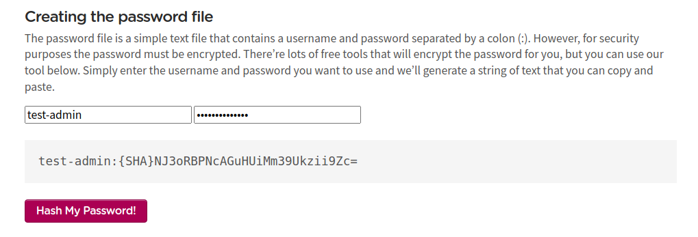

htaccess Password Protect URL
=============================

To add password protection to your website, you need to create a file to store usernames/passwords and add some code into a ``.htaccess`` file.

Creating Hash Password
----------------------

You can generate a hash password online at: https://www.lcn.com/support/articles/how-to-password-protect-a-folder-on-your-website-with-htaccess/

    Creating Hash password

Steps to Create Password Protection
------------------------------------

#. Create a file using a text editor such as Notepad or TextEdit.

#. Save the file as: ``.htpasswd``

#. Copy and paste the username/password string generated using our tool into the document.

#. Upload the ``.htpasswd`` file to your website using FTP.

#. Add the following code to the ``.htpasswd`` file::

    test-admin:{SHA}NJ3oRBPNcAGuHUiMm39Ukzii9Zc=

#. Example login credentials:

    | **Username**: test-admin
    | **Password**: test-admin@123

#. Add the following code to the ``.htaccess`` file in your website root directory (e.g., ``/var/www/html/<magento_root>/.htaccess``)::

    AuthType Basic
    AuthName "restricted area"
    AuthUserFile /var/www/html/magento/.htpasswd
    require valid-user

Understanding the .htaccess Configuration
------------------------------------------

Let's examine each line of the ``.htaccess`` configuration in detail:

**Line 1: AuthType Basic**

    Defines the type of authentication the web server will use. ``Basic`` is the standard HTTP authentication method and is adequate for password protection.

**Line 2: AuthName "restricted area"**

    Sets the title of the username/password dialog box that will appear when someone tries to access your protected page.

**Line 3: AuthUserFile /var/www/html/magento/.htpasswd**

    Specifies the absolute path to the username/password file on the server.

    .. important::
        You must update this path to match the actual location of your ``.htpasswd`` file.

    Path examples:

    - Absolute path: ``/var/www/html/magento/.htpasswd``
    - Same directory: ``./.htpasswd``
    - Parent directory: ``../.htpasswd``

**Line 4: require valid-user**

    Specifies who can access the protected folder. Using ``valid-user`` means any user listed in the ``.htpasswd`` file can access the folder.

.. note::
    After implementing these changes, users will be prompted to enter a username and password when accessing the protected directory or URL.