Sphinx & Read the Docs Guide
============================

This guide provides step-by-step instructions for setting up Sphinx documentation and hosting it on Read the Docs.

.. contents:: Table of Contents
   :local:
   :depth: 2

Introduction
------------

Sphinx is a powerful documentation generator that converts reStructuredText (RST) files into various output formats like HTML and PDF. Read the Docs is a popular hosting platform for Sphinx documentation that provides automatic building and versioning.

This guide covers:

- Installing Sphinx and required dependencies
- Creating and configuring a Sphinx project
- Building documentation locally
- Deploying to Read the Docs
- Advanced configuration and customization

Reference Links
---------------

Below are helpful reference links for learning more about Sphinx and reStructuredText.

**Sphinx Documentation:**

- `Sphinx Official Documentation <https://www.sphinx-doc.org/en/master/usage/quickstart.html>`_
- `Read the Docs Tutorial <https://docs.readthedocs.io/en/latest/tutorial/index.html>`_
- `Getting Started with Sphinx on Read the Docs <https://docs.readthedocs.io/en/stable/intro/getting-started-with-sphinx.html>`_

**reStructuredText Resources:**

- `reStructuredText Documentation Reference <https://github.com/DevDungeon/reStructuredText-Documentation-Reference>`_
- `reStructuredText Markup Specification <https://docutils.sourceforge.io/docs/ref/rst/restructuredtext.html>`_

**Video Tutorial:**

- `Live Coding Documentation <https://www.youtube.com/watch?v=UFYPLhhIDSg&list=LL&index=1>`_

Prerequisites
-------------

System Requirements
~~~~~~~~~~~~~~~~~~~

This guide assumes you are using a Debian/Ubuntu-based Linux system. For other operating systems, please refer to the `Sphinx installation guide <https://www.sphinx-doc.org/en/master/usage/installation.html>`_.

1. Install Sphinx
~~~~~~~~~~~~~~~~~

Install Sphinx using the system package manager:

.. code-block:: bash

    sudo apt-get install python3-sphinx

For more installation options, see the `official installation guide <https://www.sphinx-doc.org/en/master/usage/installation.html#linux>`_.

2. Install pip (Python Package Manager)
~~~~~~~~~~~~~~~~~~~~~~~~~~~~~~~~~~~~~~~~

If pip is not already installed, follow these steps:

.. code-block:: bash

    # Update package information
    sudo apt-get update

    # Upgrade existing packages
    sudo apt-get upgrade

    # Install pip for Python 3
    sudo apt-get install python3-pip

Verify pip installation:

.. code-block:: bash

    pip --version

Expected output:

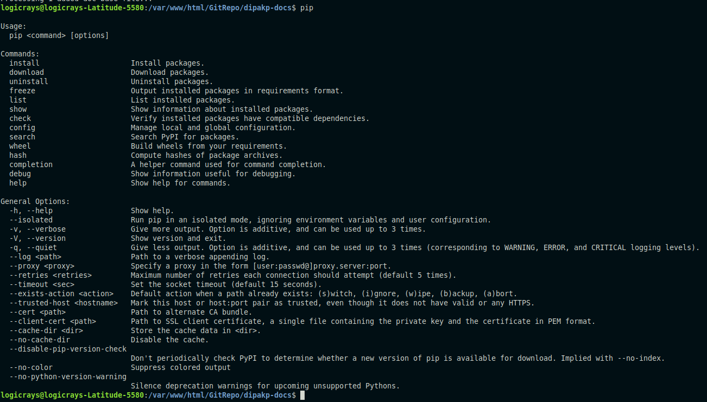

3. Install VS Code Extensions (Optional)
~~~~~~~~~~~~~~~~~~~~~~~~~~~~~~~~~~~~~~~~~

For a better development experience with VS Code, install these extensions:

**Python Extension**

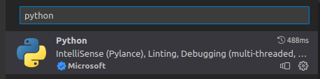

**Makefile Tools**

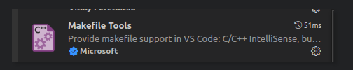

4. Install Sphinx Extensions
~~~~~~~~~~~~~~~~~~~~~~~~~~~~~

Install the required Sphinx extensions for enhanced functionality:

.. code-block:: bash

    # Install Read the Docs theme
    pip install sphinx-rtd-theme

    # Install extensions for code tabs and syntax highlighting
    pip install sphinx_code_tabs
    pip install sphinx_tabs.tabs

    # Install multimedia and interactive extensions
    pip install sphinxcontrib.video
    pip install sphinx-prompt

    # Install navigation and search enhancements
    pip install sphinx-notfound-page
    pip install sphinx-hoverxref
    pip install readthedocs-sphinx-search

    # Install design and emoji support
    pip install sphinxemoji
    pip install sphinx_design

    # Install Markdown parser (optional)
    pip install myst-parser

.. tip::
   You can install all extensions at once by creating a ``requirements.txt`` file and running ``pip install -r requirements.txt``

Quick Start Guide
-----------------

This section walks you through creating a new Sphinx documentation project from scratch.

Step 1: Create a GitHub Repository
~~~~~~~~~~~~~~~~~~~~~~~~~~~~~~~~~~~

Create a public repository on GitHub to host your documentation source code. This is required for deploying to Read the Docs.

Step 2: Initialize Local Git Repository
~~~~~~~~~~~~~~~~~~~~~~~~~~~~~~~~~~~~~~~~

Clone or initialize your repository locally:

.. code-block:: bash

    # Navigate to your project directory
    cd /var/www/html/GitRepo/dipakp-docs

    # Initialize git if not already done
    git init

    # Add your GitHub repository as remote
    git remote add origin <your_public_github_repo_url>

    # Fetch from remote (if repository already exists)
    git fetch

Replace ``<your_public_github_repo_url>`` with your actual GitHub repository URL.

Step 3: Create Documentation Directory
~~~~~~~~~~~~~~~~~~~~~~~~~~~~~~~~~~~~~~~

Create a dedicated directory for your documentation:

.. code-block:: bash

    mkdir docs

Step 4: Run Sphinx Quick Start
~~~~~~~~~~~~~~~~~~~~~~~~~~~~~~~

Initialize your Sphinx project using the interactive quick start wizard:

.. code-block:: bash

    cd docs
    sphinx-quickstart

The wizard will ask you several questions. Here are the recommended settings:

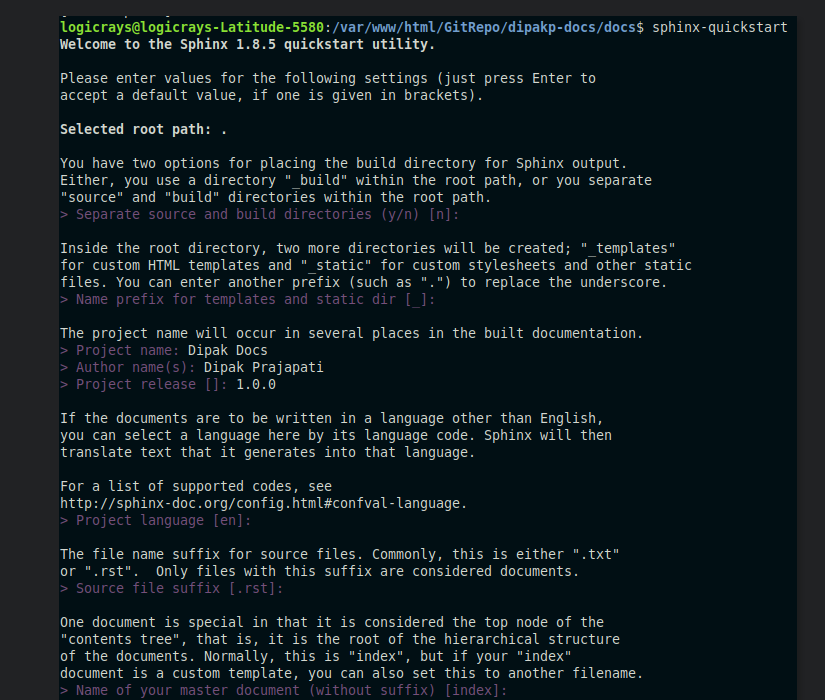

    Sphinx configuration wizard - Part 1

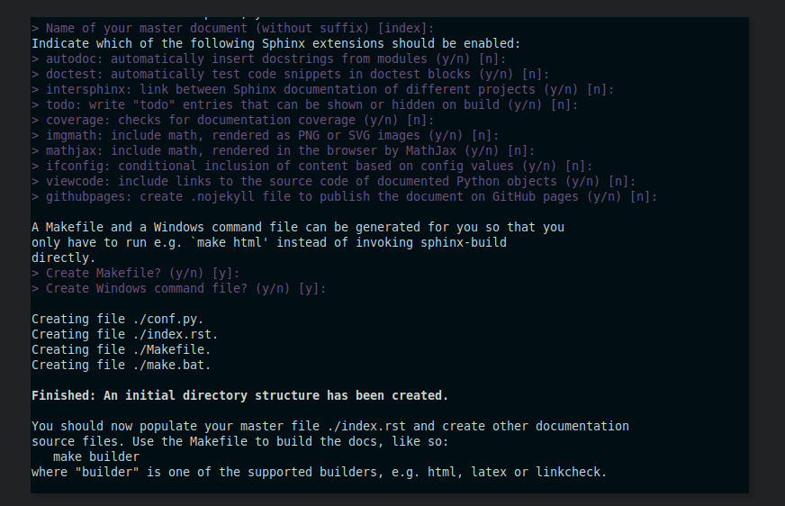

    Sphinx configuration wizard - Part 2

**Key configuration options:**

- **Separate source and build directories**: Choose "yes" (recommended)
- **Project name**: Enter your project name
- **Author name**: Enter author name(s)
- **Project release**: Enter version number (e.g., 1.0.0)
- **Project language**: Enter "en" for English

Step 5: Verify Directory Structure
~~~~~~~~~~~~~~~~~~~~~~~~~~~~~~~~~~~

After running ``sphinx-quickstart``, verify the created files and directories:

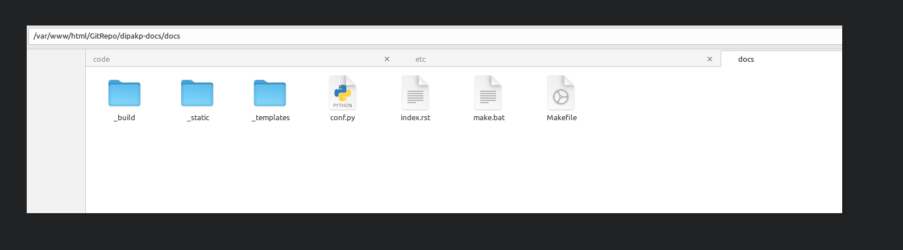

The ``docs`` directory should now contain:

- ``conf.py`` - Sphinx configuration file
- ``index.rst`` - Main documentation file
- ``Makefile`` - Build automation for Linux/Mac
- ``make.bat`` - Build automation for Windows
- ``_build/`` - Output directory (created after first build)
- ``_static/`` - Static files (CSS, images, etc.)
- ``_templates/`` - Custom HTML templates

Building Your Documentation
----------------------------

Build HTML Output
~~~~~~~~~~~~~~~~~

To generate HTML documentation, run the following command from the ``docs`` directory:

.. code-block:: bash

    make html

This will generate HTML files in ``docs/_build/html``.

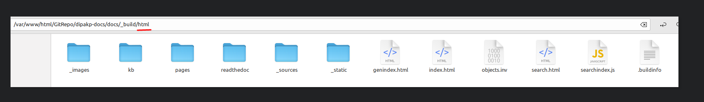

.. note::
   On Windows, use ``make.bat html`` instead.

Build Other Formats
~~~~~~~~~~~~~~~~~~~

Sphinx supports multiple output formats:

.. code-block:: bash

    # Build PDF documentation (requires LaTeX)
    make latexpdf

    # Build EPUB (e-book format)
    make epub

    # Build plain text
    make text

    # View all available formats
    make help

Preview Documentation Locally
~~~~~~~~~~~~~~~~~~~~~~~~~~~~~~

After building, you can preview your documentation locally:

**Option 1: Open directly in browser**

Navigate to ``docs/_build/html`` and open ``index.html`` in your web browser.

**Option 2: Use a local web server**

.. code-block:: bash

    # Using Python's built-in server
    cd docs/_build/html
    python -m http.server 8000

Then open http://localhost:8000 in your browser.

**Preview Screenshot:**

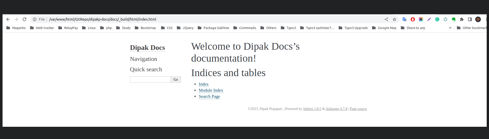

Sphinx Configuration
---------------------

The ``conf.py`` file controls all aspects of your Sphinx documentation. This section covers essential configuration options.

Change Theme
~~~~~~~~~~~~

The Read the Docs theme is the most popular theme for Sphinx documentation. To enable it, edit ``docs/conf.py``:

.. code-block:: python

    html_theme = 'sphinx_rtd_theme'

.. tip::
   Other popular themes include ``alabaster`` (default), ``sphinx_book_theme``, and ``pydata_sphinx_theme``.

Configure Extensions
~~~~~~~~~~~~~~~~~~~~

Add Sphinx extensions to enable additional features. Edit the ``extensions`` list in ``docs/conf.py``:

.. code-block:: python

    extensions = [
        # Core Sphinx extensions
        "sphinx.ext.autodoc",      # Auto-generate documentation from docstrings
        "sphinx.ext.viewcode",     # Add links to source code
        "sphinx.ext.napoleon",     # Support for NumPy and Google style docstrings

        # Third-party extensions
        "sphinxcontrib.video",     # Embed videos
        "sphinx_tabs.tabs",        # Tabbed content
        "sphinx-prompt",           # Command-line prompts
        "notfound.extension",      # Custom 404 page
        "hoverxref.extension",     # Hover tooltips for references
        "sphinxemoji.sphinxemoji", # Emoji support
        "sphinx_design",           # Design elements (cards, grids, etc.)
        "myst_parser",             # Markdown support
    ]

.. note::
   Each extension must be installed via pip before adding it to the configuration.

Advanced Configuration Options
~~~~~~~~~~~~~~~~~~~~~~~~~~~~~~~

Add these settings to the bottom of ``docs/conf.py`` for enhanced functionality:

.. code-block:: python

    # HTML output options
    # -------------------

    # Hide "View page source" links
    html_show_sourcelink = False

    # Hide "Created using Sphinx" in footer
    html_show_sphinx = False

    # Custom HTML title format
    html_title = "My Documentation"

    # Logo and favicon
    # html_logo = "_static/logo.png"
    # html_favicon = "_static/favicon.ico"

    # MyST Parser options
    # -------------------

    myst_enable_extensions = [
        "deflist",      # Definition lists
        "colon_fence",  # ::: code fences
        "substitution", # Variable substitutions
    ]

    # Hoverxref configuration
    # -----------------------

    hoverxref_auto_ref = True
    hoverxref_domains = ["py"]
    hoverxref_roles = [
        "option",
        "doc",   # Documentation pages
        "term",  # Glossary terms
    ]

    hoverxref_role_types = {
        "mod": "modal",      # Python modules
        "doc": "modal",      # Documentation pages
        "class": "tooltip",  # Python classes
        "ref": "tooltip",    # References
        "confval": "tooltip", # Configuration values
        "term": "tooltip",   # Glossary terms
    }

    hoverxref_intersphinx = [
        "sphinx",
        "pip",
        "nbsphinx",
        "myst-nb",
        "ipywidgets",
        "jupytext",
    ]

Preparing for Read the Docs Deployment
---------------------------------------

To deploy your documentation on Read the Docs, you need to prepare your repository with proper configuration files.

Step 1: Create .readthedocs.yaml Configuration
~~~~~~~~~~~~~~~~~~~~~~~~~~~~~~~~~~~~~~~~~~~~~~~

Create a ``.readthedocs.yaml`` file in your project root directory. This file ensures reproducible builds on Read the Docs.

**Reference:** `Reproducible Builds Guide <https://docs.readthedocs.io/en/stable/guides/reproducible-builds.html>`_

.. code-block:: yaml
   :caption: .readthedocs.yaml

    # Read the Docs configuration file
    # See https://docs.readthedocs.io/en/stable/config-file/v2.html

    version: 2

    # Set the version of Python and other tools
    build:
      os: ubuntu-22.04
      tools:
        python: "3.10"

    # Build documentation in the docs/ directory with Sphinx
    sphinx:
      configuration: docs/conf.py
      fail_on_warning: false

    # Optionally declare the Python requirements
    python:
      install:
        - requirements: requirements.txt

    # Build formats (PDF is optional)
    formats:
      - pdf

.. warning::
   The filename is ``.readthedocs.yaml`` (with a leading dot), not ``readthedocs.yaml``.

Step 2: Create Requirements File
~~~~~~~~~~~~~~~~~~~~~~~~~~~~~~~~~

Create a ``requirements.txt`` file in your project root to specify all Python dependencies:

.. code-block:: text
   :caption: requirements.txt

    # Sphinx core
    sphinx>=4.5.0

    # Theme
    sphinx-rtd-theme

    # Extensions
    sphinx-tabs
    sphinx-code-tabs
    sphinxcontrib-video
    sphinx-prompt
    sphinx-notfound-page
    sphinx-hoverxref
    sphinxemoji
    sphinx_design
    readthedocs-sphinx-search
    myst-parser

.. tip::
   For advanced projects, you can organize requirements into separate files in a ``requirements/`` directory.

Advanced: Organized Requirements Files
~~~~~~~~~~~~~~~~~~~~~~~~~~~~~~~~~~~~~~~

For larger projects, you can organize dependencies into separate files within a ``requirements/`` directory:

.. tabs::

    .. tab:: docs.in

        .. code-block:: text

            # Packages required to build docs, independent of application dependencies

            -r pip.txt

            sphinx_rtd_theme==1.2.0rc1
            # Note: Version 3.4.1 of sphinx-tabs requires docutils 0.18 which is yet to be supported by sphinx-rtd-theme
            # Version 3.4.0 has an incompatible Jinja2 version which also blocks sphinx-rtd-theme
            # All-together, we cannot upgrade to Sphinx 5.x before either sphinx-tabs or sphinx-rtd-theme fixes these
            # issues.
            sphinx-tabs==3.3.1
            sphinx-intl==2.0.1
            sphinx-design==0.2.0
            sphinx-multiproject==1.0.0rc1
            readthedocs-sphinx-search==0.1.2

            # Test out hoverxref
            git+https://github.com/readthedocs/sphinx-hoverxref

            # Docs
            sphinxemoji==0.2.0
            sphinxcontrib-httpdomain==1.8.1
            sphinx-prompt==1.4.0
            sphinx-notfound-page==0.8
            sphinx-autobuild==2021.3.14

            # Markdown
            myst_parser==0.17.2

            # sphinxcontrib-video
            git+https://github.com/readthedocs/sphinxcontrib-video/

    .. tab:: docs.txt

        .. code-block:: text

            #
            # This file is autogenerated by pip-compile with Python 3.10
            # by the following command:
            #
            #    pip-compile --output-file=requirements/docs.txt --resolver=backtracking requirements/docs.in
            #

            docker==6.0.1
                # via -r requirements/pip.txt
            docutils==0.17.1
                # via
                #   -r requirements/pip.txt
                #   myst-parser
                #   sphinx
                #   sphinx-rtd-theme
                #   sphinx-tabs

            sphinx==4.5.0
                # via
                #   -r requirements/pip.txt
                #   myst-parser
                #   sphinx-autobuild
                #   sphinx-design
                #   sphinx-hoverxref
                #   sphinx-intl
                #   sphinx-prompt
                #   sphinx-rtd-theme
                #   sphinx-tabs
                #   sphinxcontrib-httpdomain
                #   sphinxemoji
            sphinx-autobuild==2021.3.14
                # via -r requirements/docs.in
            sphinx-design==0.2.0
                # via -r requirements/docs.in
            sphinx-hoverxref @ git+https://github.com/readthedocs/sphinx-hoverxref
                # via -r requirements/docs.in
            sphinx-intl==2.0.1
                # via -r requirements/docs.in
            sphinx-multiproject==1.0.0rc1
                # via -r requirements/docs.in
            sphinx-notfound-page==0.8
                # via -r requirements/docs.in
            sphinx-prompt==1.4.0
                # via -r requirements/docs.in
            sphinx-rtd-theme==1.2.0rc1
                # via -r requirements/docs.in
            sphinx-tabs==3.3.1
                # via -r requirements/docs.in
            sphinxcontrib-applehelp==1.0.2
                # via
                #   -r requirements/pip.txt
                #   sphinx
            sphinxcontrib-devhelp==1.0.2
                # via
                #   -r requirements/pip.txt
                #   sphinx
            sphinxcontrib-htmlhelp==2.0.0
                # via
                #   -r requirements/pip.txt
                #   sphinx
            sphinxcontrib-httpdomain==1.8.1
                # via -r requirements/docs.in
            sphinxcontrib-jquery==3.0.0
                # via sphinx-hoverxref
            sphinxcontrib-jsmath==1.0.1
                # via
                #   -r requirements/pip.txt
                #   sphinx
            sphinxcontrib-qthelp==1.0.3
                # via
                #   -r requirements/pip.txt
                #   sphinx
            sphinxcontrib-serializinghtml==1.1.5
                # via
                #   -r requirements/pip.txt
                #   sphinx
            sphinxcontrib-video @ git+https://github.com/readthedocs/sphinxcontrib-video/
                # via -r requirements/docs.in
            sphinxemoji==0.2.0
                # via -r requirements/docs.in
            wcwidth==0.2.5
                # via
                #   -r requirements/pip.txt
                #   prompt-toolkit
            websocket-client==1.4.2
                # via
                #   -r requirements/pip.txt
                #   docker

            # The following packages are considered to be unsafe in a requirements file:
            # setuptools
            myst_parser==0.17.2

    .. tab:: pip.in

        .. code-block:: text

            # Base packages
            pip
            virtualenv

            # For intersphinx during builds
            # We need these pinned to build the docs properly
            Sphinx==4.5.0
            docutils==0.17.1

            docker

    .. tab:: pip.txt

        .. code-block:: text

            #
            # This file is autogenerated by pip-compile with Python 3.10
            # by the following command:
            #
            #    pip-compile --output-file=requirements/pip.txt --resolver=backtracking requirements/pip.in
            #
            docker==6.0.1
                # via -r requirements/pip.in
            docutils==0.17.1
                # via
                #   -r requirements/pip.in
                #   sphinx
            wcwidth==0.2.5
                # via prompt-toolkit
            websocket-client==1.4.2
                # via docker

            # The following packages are considered to be unsafe in a requirements file:
            # pip

.. note::
   If using organized requirements files, update your ``.readthedocs.yaml`` to point to the correct files:

   .. code-block:: yaml

       python:
         install:
           - requirements: requirements/pip.txt
           - requirements: requirements/docs.txt

Step 3: Configure Git Ignore
~~~~~~~~~~~~~~~~~~~~~~~~~~~~~

Create or update ``.gitignore`` in your project root to exclude build files:

.. code-block:: text
   :caption: .gitignore

    # Sphinx documentation build outputs
    docs/_build/
    docs/_static/
    docs/_templates/

    # Python
    __pycache__/
    *.py[cod]
    *$py.class
    *.so
    .Python
    env/
    venv/
    ENV/

    # IDE
    .vscode/
    .idea/
    *.swp
    *.swo

**Example Repository:** `DevDungeon/Cathy <https://github.com/DevDungeon/Cathy>`_

Step 4: Commit and Push to GitHub
~~~~~~~~~~~~~~~~~~~~~~~~~~~~~~~~~~

Now commit all your changes and push to GitHub:

.. code-block:: bash

    # Stage all files
    git add .

    # Configure git (if not already done)
    git config user.name "Your Name"
    git config user.email "your.email@example.com"

    # Commit changes
    git commit -m "Initial Sphinx documentation setup"

    # Push to GitHub
    git push -u origin master

.. important::
   Replace ``"Your Name"`` and ``"your.email@example.com"`` with your actual Git credentials.

**Example Screenshots:**

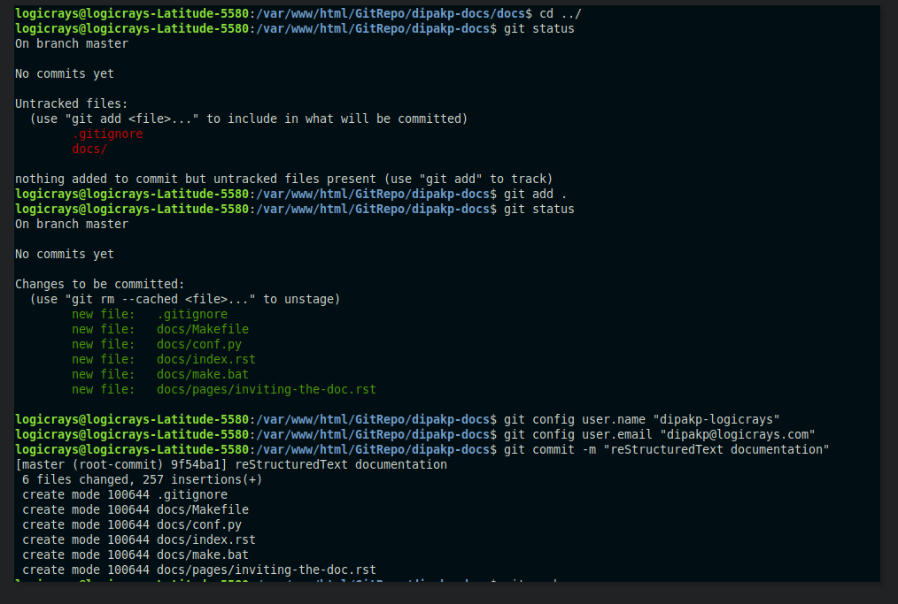

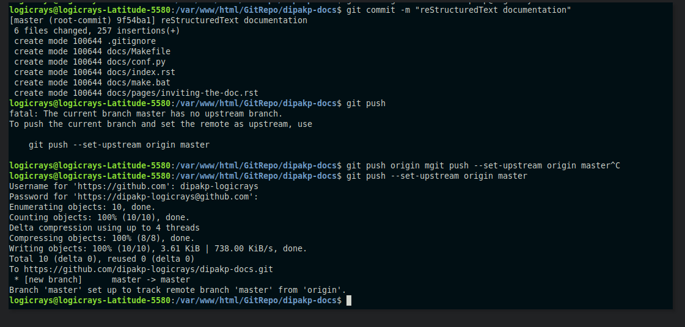

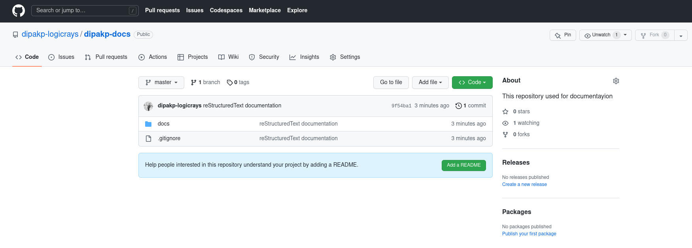

Deploying to Read the Docs
---------------------------

Once your repository is ready, you can deploy your documentation to Read the Docs.

Step 1: Create Read the Docs Account
~~~~~~~~~~~~~~~~~~~~~~~~~~~~~~~~~~~~~

If you don't have an account yet:

1. Visit `Read the Docs Sign Up <https://readthedocs.org/accounts/signup/>`_
2. Sign up using your GitHub account (recommended) or email
3. Verify your email address

Step 2: Import Your Project
~~~~~~~~~~~~~~~~~~~~~~~~~~~~

1. Log in to `Read the Docs <https://readthedocs.org/accounts/login/>`_
2. Click "Import a Project" from your dashboard
3. Connect your GitHub account if you haven't already
4. Select your documentation repository from the list
5. Click "Import"

**Detailed Guide:** `Import Guide <https://docs.readthedocs.io/en/stable/intro/import-guide.html>`_

Step 3: Configure Project Settings
~~~~~~~~~~~~~~~~~~~~~~~~~~~~~~~~~~~

After importing, configure your project:

**Basic Settings:**

- **Name:** Your project name (used in URLs)
- **Repository URL:** Should be auto-detected
- **Default branch:** Usually ``master`` or ``main``
- **Default version:** Usually ``latest``

**Advanced Settings:**

- **Documentation type:** Sphinx
- **Programming language:** Python
- **Python configuration file:** ``docs/conf.py``
- **Requirements file:** ``requirements.txt``

Step 4: Build Documentation
~~~~~~~~~~~~~~~~~~~~~~~~~~~~

Read the Docs will automatically build your documentation when you push to GitHub. You can also trigger builds manually:

1. Go to your project dashboard
2. Click "Builds" tab
3. Click "Build Version"

Monitor the build output for any errors or warnings.

Step 5: View Your Documentation
~~~~~~~~~~~~~~~~~~~~~~~~~~~~~~~~

Once the build succeeds, your documentation will be available at:

``https://<your-project-name>.readthedocs.io/``

.. tip::
   You can set up custom domains in the project settings.

Advanced: Using Sphinx Code Tabs
---------------------------------

The ``sphinx-code-tabs`` extension allows you to create tabbed code blocks for different programming languages.

Installation
~~~~~~~~~~~~

.. code-block:: bash

    pip install sphinx_code_tabs

Configuration
~~~~~~~~~~~~~

Add the extension to your ``conf.py``:

.. code-block:: python

    extensions = [
        # ... other extensions ...
        'sphinx_code_tabs',
    ]

Basic Usage
~~~~~~~~~~~

Create tabbed code blocks using the ``tabs`` directive:

.. code-block:: rst

    .. tabs::

        .. code-tab:: bash
            :caption: Bash

            echo "Hello, World!"

        .. code-tab:: python
            :caption: Python

            print("Hello, World!")

        .. code-tab:: javascript
            :caption: JavaScript

            console.log("Hello, World!");

This creates a tabbed interface where users can switch between different code examples.

Advanced Features
~~~~~~~~~~~~~~~~~

**Selected tab by default:**

.. code-block:: rst

    .. tab:: Output
        :selected:

        Hello, World!

**Grouped tabs (synchronized switching):**

.. code-block:: rst

    .. tabs:: language-group

        .. code-tab:: bash

            echo "First example"

        .. code-tab:: python

            print("First example")

    .. tabs:: language-group

        .. code-tab:: bash

            echo "Second example"

        .. code-tab:: python

            print("Second example")

When users switch tabs in one group, all other groups with the same name will switch automatically.

**Learn more:** `sphinx-code-tabs documentation <https://pypi.org/project/sphinx-code-tabs/>`_

Troubleshooting
---------------

Common Build Errors
~~~~~~~~~~~~~~~~~~~

**Error: "Module not found"**

- Ensure all required packages are listed in ``requirements.txt``
- Check that package names are spelled correctly
- Verify package versions are compatible

**Error: "Configuration file not found"**

- Verify ``.readthedocs.yaml`` points to correct ``conf.py`` location
- Check file paths use forward slashes (``/``) not backslashes

**Error: "Theme not found"**

- Add the theme package to ``requirements.txt``
- Example: ``sphinx-rtd-theme``

**Build warnings about missing files**

- Ensure all referenced images exist in the correct paths
- Check that file extensions match exactly (case-sensitive)

Performance Issues
~~~~~~~~~~~~~~~~~~

**Slow builds:**

- Reduce the number of pages being built
- Optimize image sizes
- Consider using ``sphinx-autobuild`` for local development

**Out of memory errors:**

- Reduce concurrent builds in Read the Docs settings
- Split large documentation into multiple projects
- Optimize resource-heavy extensions

Getting Help
~~~~~~~~~~~~

If you encounter issues:

1. Check the `Read the Docs documentation <https://docs.readthedocs.io/>`_
2. Review the `Sphinx documentation <https://www.sphinx-doc.org/>`_
3. Search `Stack Overflow <https://stackoverflow.com/questions/tagged/sphinx>`_
4. Ask in the `Read the Docs community <https://readthedocs.org/support/>`_

Conclusion
----------

You now have a complete Sphinx documentation setup integrated with Read the Docs. Your documentation will automatically rebuild whenever you push changes to your GitHub repository.

**Next steps:**

- Write more documentation in reStructuredText format
- Explore additional Sphinx extensions
- Customize your theme and styling
- Set up documentation versioning
- Add API documentation with autodoc

**Useful Resources:**

- `reStructuredText Primer <https://www.sphinx-doc.org/en/master/usage/restructuredtext/basics.html>`_
- `Sphinx Extensions List <https://www.sphinx-doc.org/en/master/usage/extensions/index.html>`_
- `Read the Docs Tutorial <https://docs.readthedocs.io/en/stable/tutorial/>`_

