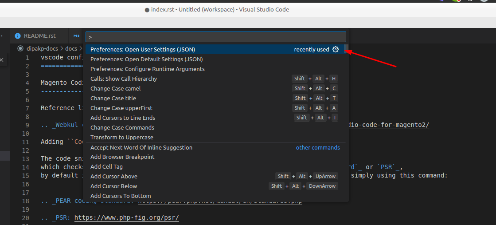
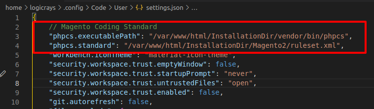
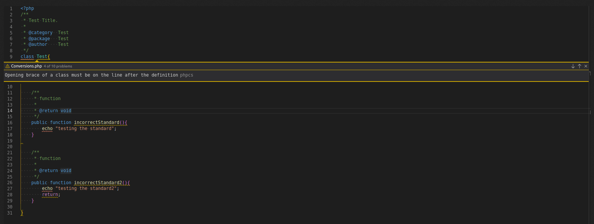
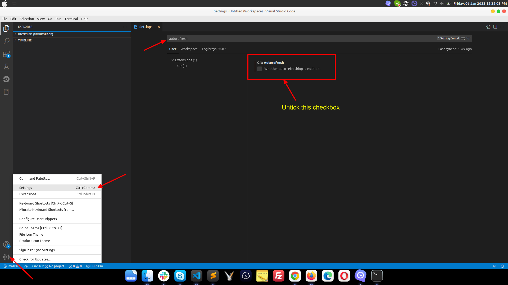
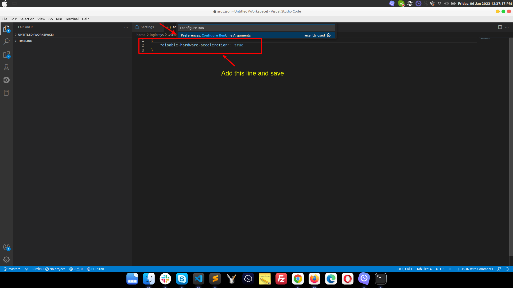

Visual Studio Code Configuration Guide
=======================================

Visual Studio Code (VS Code) is a powerful, free, and open-source code editor developed by Microsoft. This comprehensive guide covers installation, configuration, extensions, and optimization for PHP/Magento development.

.. contents:: Table of Contents
   :local:
   :depth: 2

Introduction
------------

What is Visual Studio Code?
~~~~~~~~~~~~~~~~~~~~~~~~~~~~

Visual Studio Code is a lightweight but powerful source code editor that runs on your desktop. It comes with:

- Built-in support for JavaScript, TypeScript, and Node.js
- Rich ecosystem of extensions for other languages (PHP, Python, Java, etc.)
- Integrated Git version control
- Intelligent code completion (IntelliSense)
- Built-in debugging
- Customizable themes and keyboard shortcuts

**Key Features:**

- Free and open source
- Cross-platform (Windows, macOS, Linux)
- Lightning fast performance
- Extensive extension marketplace
- Integrated terminal
- Multi-cursor editing
- Code refactoring tools

Installation
------------

Download and Install
~~~~~~~~~~~~~~~~~~~~

Download Visual Studio Code from the official website:

**Official Download:** `Visual Studio Code <https://code.visualstudio.com/download>`_

**Installation by Platform:**

.. tabs::

    .. tab:: Ubuntu/Debian

        .. code-block:: bash

            # Download .deb package from website, then:
            sudo dpkg -i code_*.deb

            # Or use snap
            sudo snap install --classic code

    .. tab:: Windows

        1. Download the Windows installer (.exe)
        2. Run the installer
        3. Follow the installation wizard
        4. Launch VS Code

    .. tab:: macOS

        1. Download the macOS .zip file
        2. Extract and move to Applications folder
        3. Launch VS Code

Verify Installation
~~~~~~~~~~~~~~~~~~~

.. code-block:: bash

    # Check VS Code version
    code --version

    # Open VS Code from terminal
    code .


PHP Code Sniffer Configuration for Magento 2
----------------------------------------------

Understanding Code Sniffers
~~~~~~~~~~~~~~~~~~~~~~~~~~~~

Code sniffers analyze your code against coding standards to ensure consistency and quality. Magento uses Squiz Labs' PHP_CodeSniffer (phpcs) with its own custom coding standard.

**Supported Standards:**

- `PEAR Coding Standard <https://pear.php.net/manual/en/standards.php>`_
- `PSR (PHP Standards Recommendations) <https://www.php-fig.org/psr/>`_
- **Magento Coding Standard** (recommended for Magento development)

**Magento Coding Standard Repository:** `magento/magento-coding-standard <https://github.com/magento/magento-coding-standard>`_

**Reference Guide:** `Webkul Code Sniffer Tutorial <https://webkul.com/blog/adding-code-sniffer-in-visual-studio-code-for-magento2/>`_

Prerequisites
~~~~~~~~~~~~~

Before setting up phpcs, ensure you have:

- VS Code installed
- Composer installed
- PHP installed and configured
- phpcs extension for VS Code

Install Magento Coding Standard
~~~~~~~~~~~~~~~~~~~~~~~~~~~~~~~~

**Step 1: Install via Composer**

.. code-block:: bash

    # Navigate to your project directory
    cd /var/www/html/

    # Install Magento coding standard
    composer create-project magento/magento-coding-standard --stability=dev InstallationDir

.. tip::
   You can install this globally or per-project. For global installation, use a common directory like ``/opt/magento-coding-standard``

**Step 2: Install phpcs Extension in VS Code**

1. Open VS Code
2. Go to Extensions (``Ctrl+Shift+X``)
3. Search for "phpcs"
4. Install the extension by Ioannis Kappas

Configure phpcs in VS Code
~~~~~~~~~~~~~~~~~~~~~~~~~~~

**Step 1: Open Settings**

Press ``Ctrl+Shift+P`` (or ``Cmd+Shift+P`` on macOS) and type "Preferences: Open Settings (JSON)"



**Step 2: Add phpcs Configuration**

Add the following configuration to your ``settings.json``:

.. code-block:: javascript

    {
        // PHP CodeSniffer executable path
        "phpcs.executablePath": "/var/www/html/InstallationDir/vendor/bin/phpcs",

        // Magento 2 coding standard ruleset
        "phpcs.standard": "/var/www/html/InstallationDir/Magento2/ruleset.xml",

        // Show warnings (optional)
        "phpcs.showWarnings": true,

        // Enable phpcs on save (optional)
        "phpcs.enable": true
    }



**Step 3: Restart VS Code**

Close and reopen VS Code to apply the changes.

Verify phpcs is Working
~~~~~~~~~~~~~~~~~~~~~~~

After configuration, phpcs will automatically highlight code standard violations:



**Common phpcs Indicators:**

- Red underlines: Errors that must be fixed
- Yellow underlines: Warnings (recommended to fix)
- Hover over underlined code to see the specific issue

Manual phpcs Commands
~~~~~~~~~~~~~~~~~~~~~

You can also run phpcs manually from the terminal:

.. code-block:: bash

    # Check a specific file
    /var/www/html/InstallationDir/vendor/bin/phpcs --standard=Magento2 path/to/file.php

    # Check an entire directory
    /var/www/html/InstallationDir/vendor/bin/phpcs --standard=Magento2 app/code/MyVendor/

    # Auto-fix issues (where possible)
    /var/www/html/InstallationDir/vendor/bin/phpcbf --standard=Magento2 path/to/file.php

Essential VS Code Extensions
-----------------------------

VS Code's power comes from its rich extension ecosystem. Here are recommended extensions for PHP/Magento development, organized by category.

How to Install Extensions
~~~~~~~~~~~~~~~~~~~~~~~~~~

**Via VS Code GUI:**

1. Open VS Code
2. Press ``Ctrl+Shift+X`` (or ``Cmd+Shift+X`` on macOS)
3. Search for the extension name
4. Click "Install"

**Via Command Line:**

.. code-block:: bash

    code --install-extension publisher.extension-name

PHP Development Extensions
~~~~~~~~~~~~~~~~~~~~~~~~~~~

**Essential PHP Extensions:**

- **PHP Intelephense** by Ben Mewburn - Advanced PHP language support with IntelliSense
- **PHP Debug** by Xdebug - Debug support for PHP with Xdebug
- **phpcs (Phpcs)** by shevaua - PHP CodeSniffer integration for code quality
- **PHPStan** - Static analysis tool for finding bugs
- **PHP DocBlocker** by Neil Brayfield - Auto-generate PHP documentation blocks
- **PHP Getters & Setters** by phproberto - Generate getters and setters for PHP classes
- **PHP Constructor** by Mehedi Hassan - Initialize properties from constructor
- **PHP Awesome Snippets** by HakCorp - Collection of useful PHP snippets
- **PHP Support Utils** by Open Southeners - Additional PHP utilities
- **PHPUnit Snippets** by Winnie Lin - Snippets for PHPUnit testing
- **Better PHPUnit** by calebporzio - A better PHPUnit test runner
- **PHP Array Symbol Provider for VS Code** by MrChetan - PHP Array Symbol Provider for VS Code
- **PHP Class Generator** by damianbal - Generate class and namespace out of file path
- **PHP Copy Reference** by MDOQ - Adds "Copy reference" to context menu
- **PHP Namespace Resolver** by Mehedi Hassan - Import and expand PHP namespaces

Magento Development Extensions
~~~~~~~~~~~~~~~~~~~~~~~~~~~~~~~

**Magento-Specific Extensions:**

- **Magento 2 Snippets** by Jerry Lopez - Code snippets for Magento 2 development
- **Magento Snippets** - Additional Magento code snippets
- **MagentoWizard** by viperet - Magento module and file generation wizard
- **AutoMageDev** by Webkul - Automate Magento development tasks
- **Magento DevSearch** by Rafael Corrêa Gomes - Quick search in Magento documentation
- **Magento Language Server** by pbogut - Language support for Magento files
- **Magento PHP Developer Productivity Pack** by Dipak - Enhanced productivity for Magento PHP development
- **Adobe Commerce Snippets** - Snippets for Adobe Commerce/Magento development

Version Control Extensions
~~~~~~~~~~~~~~~~~~~~~~~~~~~

**Git Extensions:**

- **GitLens** by GitKraken - Supercharge Git capabilities, view history, blame, etc.
- **Git Graph** by mhutchie - View a Git Graph of your repository and perform Git actions

HTML/CSS/JavaScript Extensions
~~~~~~~~~~~~~~~~~~~~~~~~~~~~~~~

**Frontend Development:**

- **Auto Close Tag** by Jun Han - Automatically close HTML/XML tags
- **Auto Rename Tag** by Jun Han - Auto rename paired HTML/XML tags
- **HTML Snippets** - HTML5 code snippets
- **HTML CSS Class Completion** by Zignd - CSS class name completion for HTML
- **Live Server** by Ritwick Dey - Launch local development server with live reload
- **LiveReload** by ziishaned - Live reload for static and dynamic pages
- **jQuery Code Snippets** by Don Jayamanne - jQuery code snippets
- **jQuery Snippets** by hridoy - Additional jQuery snippets
- **JavaScript (ES6) code snippets** by xabikos - ES6 syntax and React/Redux snippets
- **Simple React Snippets** by Burke Holland - Essential React snippets
- **React PropTypes IntelliSense** by ofhumanbondage - IntelliSense for React PropTypes
- **ES7+ React/Redux/React-Native snippets** by dsznajder - Extensions for React, Redux, and React-Native
- **Mithril Emmet** by FallenMax - Emmet support for faster HTML/CSS coding
- **Tailwind CSS IntelliSense** by Tailwind Labs - Intelligent Tailwind CSS class suggestions

Productivity Extensions
~~~~~~~~~~~~~~~~~~~~~~~

**Boost Your Productivity:**

- **Better Comments** by Aaron Bond - Color-coded comments for better readability
- **Trailing Spaces** by Shardul Mahadik - Highlight and remove trailing spaces
- **change-case** by wmaurer - Quickly change the case of text
- **Color Picker** by anseki - Visual color picker and palette
- **ToDo+** - Manage TODO, FIXME, and other tags
- **Regex Previewer** by Christof Marti - Test regular expressions in real-time
- **Bookmarks** by Alessandro Fragnani - Mark lines and jump to them
- **Path Autocomplete** by Mihai Vilcu - Auto-complete file paths
- **Indent Rainbow** by oderwat - Colorize indentation for better readability
- **CodeSnap** by adpyke - Take beautiful screenshots of your code
- **Sort Lines** by Tyriar - Sort lines of text
- **Duplicate** by mrmlnc - Duplicate files and directories
- **EditorConfig** by EditorConfig - EditorConfig support for VS Code
- **Save As Snippet** by Arty - Save selected text as a snippet

AI-Powered Extensions
~~~~~~~~~~~~~~~~~~~~~

**AI Assistance:**

- **Claude Code for VS Code** by Anthropic - Harness the power of Claude AI for coding assistance
- **GitHub Copilot** by GitHub - AI pair programmer from GitHub
- **GitHub Copilot Chat** by GitHub - Chat with GitHub Copilot for coding help
- **Cody AI** - AI-powered code assistant
- **ChatGPT GPT-4 - Bito AI Code Assistant** - GPT-4 powered code help
- **Mintlify Doc Writer** by Mintlify - AI-generated documentation for multiple languages
- **Tabnine** by TabNine - AI code completions
- **IntelliCode** by Microsoft - AI-assisted development
- **IntelliCode API Usage Examples** by Microsoft - See relevant code examples

Remote Development Extensions
~~~~~~~~~~~~~~~~~~~~~~~~~~~~~~

**Remote Development Tools:**

- **Remote - SSH** by Microsoft - Open any folder on a remote machine using SSH
- **Remote - SSH: Editing Configuration Files** by Microsoft - Edit SSH configuration files
- **WSL** by Microsoft - Open any folder in the Windows Subsystem for Linux
- **Remote Development** by Microsoft - An extension pack that lets you open any folder in a container, on a remote machine, or in WSL
- **Remote Explorer** by Microsoft - View remote machines for SSH and Tunnels
- **Remote - Tunnels** by Microsoft - Connect to a remote machine through a Tunnel

.. tip::
   The **Remote Development** extension pack includes Remote - SSH, Remote - Containers, and Remote - WSL extensions for a complete remote development experience.

Utility Extensions
~~~~~~~~~~~~~~~~~~

**Useful Utilities:**

- **Thunder Client** by Ranga Vadhineni - REST API client (alternative to Postman)
- **Excel Viewer** by GrapeCity - View Excel files in VS Code
- **Excel to Markdown Table** by csholmq - Convert Excel to Markdown tables
- **Email** by leighlondon - Email utilities
- **XML Tools** by Josh Johnson - XML formatting and XPath tools
- **GraphQL: Syntax Highlighting** by GraphQL Foundation - GraphQL syntax support
- **GraphQL** by Prisma - GraphQL support with syntax highlighting and IntelliSense
- **Large file support for extensions** by mbehr1 - Handle large files efficiently
- **SVG** by jock - SVG support and preview
- **SVG Preview** by Simon Siefke - Preview SVG files
- **PDF** by tomoki1207 - Display PDF files in VS Code
- **Draw.io Integration** by Henning Dieterichs - Draw diagrams in VS Code
- **Markdown Preview Enhanced** by Yiyi Wang - Enhanced Markdown preview
- **Rainbow CSV** by mechatroner - Highlight CSV and TSV files
- **Zoombar** by wraith13 - Zoom status bar item
- **Terminal Zoom** by trybick - Zoom terminal text
- **Dashboard** by Kruemelkatze - Quick access to projects and files
- **VSIX Viewer** by Onur Yildirim - View VSIX package contents

Configuration Extensions
~~~~~~~~~~~~~~~~~~~~~~~~~

**Configuration File Support:**

- **Apache Conf** by mrmlnc - Syntax highlighting for Apache config files
- **Nginx Configuration** by ahmadalli - Nginx configuration syntax support
- **Nginx Formatter** by raynigon - Format Nginx configuration files
- **Composer** by DEVSENSE - Composer support for PHP
- **Markdown All in One** by Yu Zhang - Markdown support and preview
- **markdownlint** by David Anson - Markdown linting and style checking
- **DotENV** by mikestead - Support for .env files
- **YAML** by Red Hat - YAML language support
- **reStructuredText** by LeXtudio Inc. - reStructuredText language support
- **ESLint** by Microsoft - JavaScript linting
- **SonarLint** by SonarSource - Detect bugs and quality issues

Container & DevOps Extensions
~~~~~~~~~~~~~~~~~~~~~~~~~~~~~~

**Docker and Containers:**

- **Docker** by Microsoft - Docker support for VS Code
- **Dev Containers** by Microsoft - Open folders in containers

Database Extensions
~~~~~~~~~~~~~~~~~~~

**Database Management:**

- **Database Client** by Weijan Chen - Universal database client for VS Code
- **Database Client JDBC** by Weijan Chen - JDBC-based database client

Theme Extensions
~~~~~~~~~~~~~~~~

**Customize Appearance:**

- **Material Icon Theme** by Philipp Kief - Material Design file icons
- **Material Theme** by Equinusocio - Material Design color theme
- **Material Theme Icons** by Equinusocio - Additional Material icons
- **vscode-icons** by VSCode Icons Team - File icons for Visual Studio Code

Performance Optimization
------------------------

Fixing VS Code Freeze or Hang Issues
~~~~~~~~~~~~~~~~~~~~~~~~~~~~~~~~~~~~~

If VS Code freezes or becomes slow, especially with large projects, here are solutions.

Solution 1: Exclude Large Directories
~~~~~~~~~~~~~~~~~~~~~~~~~~~~~~~~~~~~~~~

Update your workspace or user ``settings.json`` to exclude large directories from file watching:

.. code-block:: json

    {
        "files.exclude": {
            "**/.git": true,
            "**/.svn": true,
            "**/.hg": true,
            "**/CVS": true,
            "**/.DS_Store": true,
            "**/node_modules": true,
            "**/.firebase": true
        },
        "files.watcherExclude": {
            "**/.git/objects/**": true,
            "**/.git/subtree-cache/**": true,
            "**/node_modules/**": true,
            "**/var/**": true,
            "**/pub/static/**": true,
            "**/generated/**": true
        }
    }

.. tip::
   For Magento projects, add ``**/var/**``, ``**/pub/static/**``, and ``**/generated/**`` to exclude large generated directories.

Solution 2: Disable Git Auto Refresh
~~~~~~~~~~~~~~~~~~~~~~~~~~~~~~~~~~~~~

Disable automatic Git refresh to reduce CPU usage:

1. Press ``Ctrl+,`` to open Settings
2. Search for "git.autorefresh"
3. Uncheck the option

Or add to ``settings.json``:

.. code-block:: json

    {
        "git.autorefresh": false
    }



    Disable Git auto refresh

Solution 3: Disable Hardware Acceleration
~~~~~~~~~~~~~~~~~~~~~~~~~~~~~~~~~~~~~~~~~~

If VS Code still freezes, try disabling hardware acceleration:

1. Press ``Ctrl+Shift+P``
2. Type "Configure Runtime Arguments"
3. Select "Preferences: Configure Runtime Arguments"
4. Add the following line before the closing bracket:

.. code-block:: json

    "disable-hardware-acceleration": true



    Disable hardware acceleration

Solution 4: Increase File Size Limits
~~~~~~~~~~~~~~~~~~~~~~~~~~~~~~~~~~~~~~

For large projects, increase file size limits:

.. code-block:: json

    {
        "intelephense.files.maxSize": 10000000,
        "workbench.editorLargeFileConfirmation": 100
    }

Solution 5: Disable Unused Extensions
~~~~~~~~~~~~~~~~~~~~~~~~~~~~~~~~~~~~~~

Disable extensions you don't need to improve performance:

1. Go to Extensions (``Ctrl+Shift+X``)
2. Right-click on unused extensions
3. Select "Disable" or "Disable (Workspace)"

setting.json File Example
-------------------------

This is my ``vscode settings.json`` file content::

    {
        "auto-rename-tag.activationOnLanguage": [
            "*"
        ],
        "better-comments.highlightPlainText": true,
        "codesnap.backgroundColor": "#c3abab",
        "codesnap.realLineNumbers": true,
        "codesnap.showWindowTitle": true,
        "debug.javascript.defaultRuntimeExecutable": {
            "pwa-node": "node"
        },
        "diffviewer.matchingMaxComparisons": 25000,
        "diffviewer.maxLineLengthHighlight": 100000,
        "diffviewer.outputFormat": "side-by-side",
        "diffviewer.renderNothingWhenEmpty": true,
        "editor.autoClosingQuotes": "always",
        "editor.bracketPairColorization.independentColorPoolPerBracketType": true,
        "editor.cursorBlinking": "solid",
        "editor.cursorStyle": "line",
        "editor.fontFamily": "Cascadia Code NF",
        "editor.formatOnType": true,
        "editor.guides.bracketPairs": true,
        "editor.inlineSuggest.showToolbar": "onHover",
        "editor.inlineSuggest.suppressSuggestions": true,
        "editor.linkedEditing": true,
        "editor.minimap.maxColumn": 75,
        "editor.minimap.scale": 2,
        "editor.minimap.sectionHeaderFontSize": 10,
        "editor.minimap.showSlider": "always",
        "editor.mouseWheelZoom": true,
        "editor.quickSuggestions": {
            "other": "on",
            "comments": "on",
            "strings": "on"
        },
        "editor.showFoldingControls": "always",
        "editor.stickyScroll.enabled": true,
        "editor.suggest.snippetsPreventQuickSuggestions": false,
        "editor.wordWrap": "on",
        "explorer.confirmPasteNative": false,
        "files.associations": {
            "*.module": "php"
        },
        "files.eol": "\n",
        "files.exclude": {
            "**/.git": true,
            "**/.svn": true,
            "**/.hg": true,
            "**/CVS": true,
            "**/.DS_Store": true,
            "**/node_modules": true,
            "**/.firebase": true
        },
        "files.watcherExclude": {
            "**/.git/objects/**": true,
            "**/.git/subtree-cache/**": true,
            "**/node_modules/**": true,
            "**/var/**": true,
            "**/pub/static/**": true,
            "**/generated/**": true
        },
        "git.autorefresh": false,
        "git.openRepositoryInParentFolders": "never",
        "github.copilot.advanced": {},
        "indentRainbow.colors": [
            "rgba(255,255,64,0.3)",
            "rgba(127,255,127,0.3)",
            "rgba(255,127,255,0.3)",
            "rgba(79,236,236,0.3)"
        ],
        "indentRainbow.ignoreLinePatterns": [
            "/[ \t]* [*]/g",
            "/[ \t]+[/]{2}/g"
        ],
        "indentRainbow.indicatorStyle": "light",
        "indentRainbow.lightIndicatorStyleLineWidth": 1,
        "intelephense.completion.fullyQualifyGlobalConstantsAndFunctions": true,
        "intelephense.diagnostics.argumentCount": false,
        "intelephense.diagnostics.deprecated": false,
        "intelephense.diagnostics.duplicateSymbols": false,
        "intelephense.diagnostics.embeddedLanguages": false,
        "intelephense.diagnostics.enable": false,
        "intelephense.diagnostics.implementationErrors": false,
        "intelephense.diagnostics.languageConstraints": false,
        "intelephense.diagnostics.typeErrors": false,
        "intelephense.diagnostics.undefinedClassConstants": false,
        "intelephense.diagnostics.undefinedConstants": false,
        "intelephense.diagnostics.undefinedFunctions": false,
        "intelephense.diagnostics.undefinedMethods": false,
        "intelephense.diagnostics.undefinedProperties": false,
        "intelephense.diagnostics.undefinedSymbols": false,
        "intelephense.diagnostics.undefinedTypes": false,
        "intelephense.diagnostics.undefinedVariables": false,
        "intelephense.diagnostics.unexpectedTokens": false,
        "intelephense.diagnostics.unusedSymbols": false,
        "intelephense.files.exclude": [
            "**/.git/**",
            "**/.svn/**",
            "**/.hg/**",
            "**/CVS/**",
            "**/.DS_Store/**",
            "**/node_modules/**",
            "**/bower_components/**",
            "**/.history/**",
            "**/.tsx/**"
        ],
        "intelephense.files.maxSize": 10000000,
        "intelephense.format.enable": false,
        "intelephense.phpdoc.useFullyQualifiedNames": true,
        "javascript.inlayHints.enumMemberValues.enabled": true,
        "javascript.inlayHints.functionLikeReturnTypes.enabled": true,
        "json.maxItemsComputed": 10000,
        "merge-conflict.autoNavigateNextConflict.enabled": true,
        "notebook.showFoldingControls": "always",
        "php-docblocker.useShortNames": true,
        "php-docblocker.alignReturn": true,
        "php-docblocker.qualifyClassNames": true,
        "php.suggest.basic": false,
        "php.validate.run": "onType",
        "phpcs.executablePath": "/var/www/html/InstallationDir/vendor/bin/phpcs",
        "phpcs.showWarnings": true,
        "phpcs.standard": "/var/www/html/InstallationDir/Magento2/ruleset.xml",
        "redhat.telemetry.enabled": false,
        "search.exclude": {
            "**.git": true,
            "**/.git": true
        },
        "security.workspace.trust.emptyWindow": false,
        "security.workspace.trust.enabled": false,
        "security.workspace.trust.startupPrompt": "never",
        "security.workspace.trust.untrustedFiles": "open",
        "sonarlint.connectedMode.project": {},
        "sonarlint.focusOnNewCode": true,
        "sonarlint.ls.javaHome": "/usr/lib/jvm/java-17-openjdk-amd64",
        "sonarlint.output.showAnalyzerLogs": true,
        "sonarlint.pathToNodeExecutable": "/home/logicrays/.nvm/versions/node/v18.19.1/bin/node",
        "sonarlint.rules": {
            "javascript:S6582": {
                "level": "on"
            }
        },
        "terminal.integrated.env.linux": {},
        "terminal.integrated.shellIntegration.history": 10000,
        "trailing-spaces.backgroundColor": "rgba(255,0,0,0.8)",
        "typescript.suggest.paths": false,
        "vsc-lfs.replacements": [],
        "vscodesnap.realLineNumbers": true,
        "vscodesnap.showWindowTitle": true,
        "vscodesnap.windowBorderRadius": "5px",
        "vscodesnap.windowControlStyle": "OS X",
        "window.title": "${dirty}${activeEditorLong}${separator}${rootName}${separator}${profileName}${separator}${appName}",
        "window.titleBarStyle": "native",
        "window.zoomLevel": 0.2676050217395348,
        "workbench.colorCustomizations": {},
        "workbench.editor.empty.hint": "hidden",
        "workbench.editor.highlightModifiedTabs": true,
        "workbench.editor.tabSizingFixedMaxWidth": 250,
        "workbench.editor.tabSizingFixedMinWidth": 100,
        "workbench.editor.wrapTabs": true,
        "workbench.editorAssociations": {
            "*.gz": "default",
            "*.php": "default"
        },
        "workbench.iconTheme": "material-icon-theme",
        "workbench.list.horizontalScrolling": true,
        "workbench.startupEditor": "none",
        "workbench.tree.enableStickyScroll": true,
        "workbench.tree.stickyScrollMaxItemCount": 10,
        "[typescriptreact]": {},
        "print.folder.fileNames": true,
        "print.folder.include": [],
        "print.folder.exclude": [
            "{bin,obj,out}",
            "node_modules",
            "data",
            "**/*.{bin,exe,dll,hex,pdb,pdf,pfx,png,jpg,gif,bmp,suo,design}"
        ],
        "print.folder.maxLines": 1200,
        "print.folder.maxFiles": 30,
        "print.folder.includeFileList": false,
        "editor.fontLigatures": false,
        "vsicons.dontShowNewVersionMessage": true,
        "editor.codeActionsOnSave": {},
        "editor.semanticTokenColorCustomizations": {},
        "php.validate.executablePath": "/usr/bin/php",
        "database-client.autoSync": true,
        "database-client.queryWithSchema": true,
        "editor.minimap.autohide": "none",
        "workbench.editorLargeFileConfirmation": 100,
        "workbench.editor.decorations.colors": false,
        "github.copilot.chat.agent.runTasks": false,
        "github.copilot.chat.agent.thinkingTool": true,
        "github.copilot.chat.startDebugging.enabled": false,
        "chat.mcp.serverSampling": {
            "Global in Code: figma": {
                "allowedModels": [
                    "copilot/gpt-4.1",
                    "copilot/gpt-5-mini"
                ]
            }
        },
        "editor.minimap.enabled": false,
        "terminal.integrated.fontSize": 13,
        "terminal.integrated.fontFamily": "Cascadia Code NF",
        "window.commandCenter": false
    }

Custom Code Snippets
---------------------

Creating custom snippets can significantly boost your productivity.

How to Create PHP Snippets
~~~~~~~~~~~~~~~~~~~~~~~~~~~

**Step 1: Open Snippets Configuration**

1. Press ``Ctrl+Shift+P`` (or ``Cmd+Shift+P`` on macOS)
2. Type "Configure User Snippets"
3. Select "php.json" (or create it if it doesn't exist)

**Step 2: Add Custom Snippets**

Add your custom snippets in JSON format:

.. code-block:: javascript
   :caption: php.json

    {
        // Print and exit for debugging
        "PrintR and exit": {
            "prefix": "ep",
            "body": [
                "echo '<pre>';",
                "print_r($1);",
                "exit();"
            ],
            "description": "Echo print_r and exit for debugging"
        },

        // Custom logger for Magento
        "Print Custom Logger": {
            "prefix": "cLog",
            "body": [
                "$writer = new \\Zend_Log_Writer_Stream(BP . '/var/log/custom.log');",
                "$logger = new \\Zend_Log();",
                "$logger->addWriter($writer);",
                "$logger->info(print_r($1, true));"
            ],
            "description": "Print to custom log file"
        },

        // Var dump and die
        "Var dump and die": {
            "prefix": "vdd",
            "body": [
                "var_dump($1);",
                "die();"
            ],
            "description": "Var dump and die"
        }
    }

**Using Snippets:**

- Type ``ep`` and press Tab to use "PrintR and exit"
- Type ``cLog`` and press Tab to use custom logger
- Type ``vdd`` and press Tab to use "Var dump and die"

Snippet Variables
~~~~~~~~~~~~~~~~~

Snippets support special variables:

.. code-block:: text

    $1, $2, $3, ...  - Tab stops (cursor positions)
    $0               - Final cursor position
    ${1:label}       - Placeholder with default text
    ${1|one,two,three|} - Choice selection

**Example with placeholders:**

.. code-block:: json

    "Create PHP Class": {
        "prefix": "class",
        "body": [
            "<?php",
            "namespace ${1:Vendor\\Module\\Model};",
            "",
            "class ${2:ClassName}",
            "{",
            "    public function ${3:methodName}()",
            "    {",
            "        $0",
            "    }",
            "}"
        ]
    }

Essential Keyboard Shortcuts
-----------------------------

General Shortcuts
~~~~~~~~~~~~~~~~~

.. list-table::
   :header-rows: 1
   :widths: 40 60

   * - Shortcut
     - Description
   * - ``Ctrl+Shift+P``
     - Command Palette
   * - ``Ctrl+P``
     - Quick file open
   * - ``Ctrl+,``
     - Open Settings
   * - ``Ctrl+K Ctrl+S``
     - Keyboard Shortcuts
   * - ``Ctrl+```
     - Toggle terminal
   * - ``Ctrl+B``
     - Toggle sidebar

Editing Shortcuts
~~~~~~~~~~~~~~~~~

.. list-table::
   :header-rows: 1
   :widths: 40 60

   * - Shortcut
     - Description
   * - ``Ctrl+D``
     - Select word / Multi-cursor
   * - ``Ctrl+Shift+L``
     - Select all occurrences
   * - ``Alt+Click``
     - Add cursor
   * - ``Ctrl+/``
     - Toggle line comment
   * - ``Shift+Alt+A``
     - Toggle block comment
   * - ``Ctrl+Shift+K``
     - Delete line
   * - ``Alt+↑/↓``
     - Move line up/down
   * - ``Shift+Alt+↑/↓``
     - Copy line up/down

Code Navigation
~~~~~~~~~~~~~~~

.. list-table::
   :header-rows: 1
   :widths: 40 60

   * - Shortcut
     - Description
   * - ``F12``
     - Go to definition
   * - ``Alt+F12``
     - Peek definition
   * - ``Shift+F12``
     - Go to references
   * - ``Ctrl+Shift+O``
     - Go to symbol in file
   * - ``Ctrl+T``
     - Go to symbol in workspace
   * - ``Ctrl+G``
     - Go to line
   * - ``Ctrl+Tab``
     - Navigate between files

Search and Replace
~~~~~~~~~~~~~~~~~~

.. list-table::
   :header-rows: 1
   :widths: 40 60

   * - Shortcut
     - Description
   * - ``Ctrl+F``
     - Find in file
   * - ``Ctrl+H``
     - Replace in file
   * - ``Ctrl+Shift+F``
     - Find in workspace
   * - ``Ctrl+Shift+H``
     - Replace in workspace
   * - ``F3 / Shift+F3``
     - Find next/previous

Tips and Best Practices
------------------------

Workspace vs User Settings
~~~~~~~~~~~~~~~~~~~~~~~~~~~

- **User Settings:** Apply globally to all VS Code instances
- **Workspace Settings:** Apply only to current project
- Workspace settings override user settings

.. tip::
   Use workspace settings for project-specific configurations like phpcs paths.

Increase Productivity
~~~~~~~~~~~~~~~~~~~~~

1. **Master keyboard shortcuts** - Reduces mouse usage
2. **Use multi-cursor editing** - Edit multiple lines simultaneously (``Ctrl+D``)
3. **Leverage IntelliSense** - Auto-completion saves time (``Ctrl+Space``)
4. **Use integrated terminal** - No need to switch windows (``Ctrl+```)
5. **Install relevant extensions** - Only what you need
6. **Create custom snippets** - For frequently used code patterns
7. **Use Git integration** - Built-in version control

Debugging PHP in VS Code
~~~~~~~~~~~~~~~~~~~~~~~~~

1. Install **PHP Debug** extension
2. Install Xdebug on your server
3. Configure ``launch.json``:

.. code-block:: json

    {
        "version": "0.2.0",
        "configurations": [
            {
                "name": "Listen for Xdebug",
                "type": "php",
                "request": "launch",
                "port": 9003
            }
        ]
    }

4. Set breakpoints by clicking left of line numbers
5. Press ``F5`` to start debugging

Conclusion
----------

Visual Studio Code is a powerful, flexible code editor that can be customized to fit your PHP/Magento development workflow. This guide covered:

- Installation and basic setup
- PHP CodeSniffer configuration for code quality
- Essential extensions for PHP/Magento development
- Performance optimization techniques
- Custom snippets for productivity
- Keyboard shortcuts for efficiency

**Next Steps:**

- Explore the VS Code Extension Marketplace
- Configure debugging for your projects
- Create project-specific workspace settings
- Learn advanced Git features with GitLens
- Set up remote development with SSH

**Additional Resources:**

- `Official VS Code Documentation <https://code.visualstudio.com/docs>`_
- `VS Code PHP Development <https://code.visualstudio.com/docs/languages/php>`_
- `VS Code Extension API <https://code.visualstudio.com/api>`_
- `VS Code Keyboard Shortcuts PDF <https://code.visualstudio.com/shortcuts/keyboard-shortcuts-windows.pdf>`_