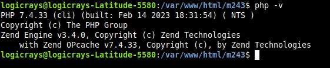
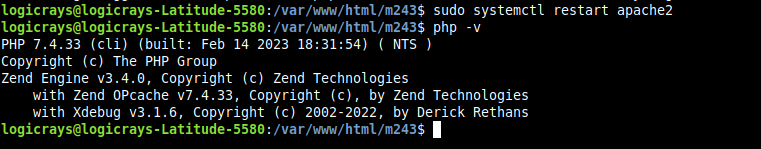

Xdebug in VS Code for PHP
==========================

Xdebug is a PHP extension that provides debugging and profiling capabilities. This article shows how you can enable and use Xdebug in the VS Code editor.

Prerequisites
-------------

Before starting, ensure you have the following installed on your system:

- **PHP** (7.4 or higher recommended)
- **Apache** web server
- **VS Code** editor
- **Node.js and npm** (for VS Code extensions)
- **NVM** (Node Version Manager, optional but recommended)

Official Documentation
----------------------

- **Xdebug 3 Official Documentation**: https://xdebug.org/docs/
- **Xdebug Installation Guide**: https://xdebug.org/docs/install

Check Xdebug Installation Status
---------------------------------

To check if Xdebug is installed and view its version, run the following command::

    php -v

The output will display information about PHP and any installed extensions, including Xdebug.

    PHP version output without Xdebug installed

.. note::
    This screenshot was captured while testing ``Magento 2.4.3`` with ``PHP 7.4``.

Install Xdebug
--------------

Install Xdebug for your PHP version. For example, to install Xdebug for PHP 8.1:

.. code-block:: bash

    sudo apt-get install php8.1-xdebug

.. note::
    Replace ``php8.1`` with your PHP version (e.g., ``php7.4``, ``php8.0``, ``php8.2``, etc.).

After installation, restart the Apache web server:

.. code-block:: bash

    sudo systemctl restart apache2

Verify the installation by running ``php -v`` again:

    PHP version output with Xdebug installed

.. note::
    This screenshot was captured while debugging ``Magento 2.4.3`` with ``PHP 7.4``.

Install PHP Debug Extension in VS Code
---------------------------------------

#. Open the VS Code editor.

#. Install the ``PHP Debug`` extension by Xdebug from the Extensions marketplace.

    .. figure:: images/php-debug-extension-vscode.png
        :align: center
        :alt: PHP Debug extension in VS Code

        PHP Debug extension in VS Code marketplace

Configure Xdebug
----------------

Follow these steps to configure Xdebug:

#. Create a file named ``xdebuginfo.php`` in your web root with the following content:

    .. code-block:: php

        <?php echo xdebug_info(); ?>

#. Access this file in your browser to find the Xdebug configuration file path.

#. Look for the **Additional .ini files parsed** section to find the path to ``20-xdebug.ini``.

    .. figure:: images/php-xdebug-ini-file-path.jpg
        :align: center
        :alt: Xdebug ini file path

        Xdebug configuration file path

#. For PHP 8.1, open the file ``/etc/php/8.1/apache2/conf.d/20-xdebug.ini`` and add the following configuration:

    .. code-block:: ini

        zend_extension=xdebug.so
        xdebug.mode=develop,debug
        ; Use 'trigger' when debug is not needed, change to 'yes' when debugging
        xdebug.start_with_request = trigger

    .. note::
        Replace ``8.1`` with your PHP version in the file path.

#. Restart Apache to apply the changes:

    .. code-block:: bash

        sudo systemctl restart apache2

Create launch.json Configuration File
--------------------------------------

#. Open your project in VS Code.

#. Open the Debug view by clicking the ``Debugger`` icon in the left sidebar or press ``Ctrl + Shift + D``.

    .. figure:: images/run-debug.png
        :align: center
        :alt: VS Code debug view

        VS Code Debug view

#. Click on ``create a launch.json file`` link.

    .. figure:: images/create-launch-json.png
        :align: center
        :alt: Create launch.json

        Create launch.json file

#. Select ``PHP`` as the environment from the popup menu.

#. This will create a ``.vscode/launch.json`` file with default configuration. Add the ``pathMappings`` property after ``"port": 9003`` in the configuration section:

    .. code-block:: json

        "pathMappings": {
            "/var/www/html/<your_project_directory_name>": "${workspaceFolder}"
        }

    .. important::
        Replace ``<your_project_directory_name>`` with your actual project directory name on the server.

Understanding pathMappings
~~~~~~~~~~~~~~~~~~~~~~~~~~

**pathMappings** is a critical configuration that maps server paths to local paths on your machine.

- This mapping allows VS Code to correctly associate files on the server with files in your local workspace.
- Without proper path mapping, breakpoints may not work correctly.

Example launch.json Configuration
~~~~~~~~~~~~~~~~~~~~~~~~~~~~~~~~~~

Here's a complete example of a ``launch.json`` file:

.. code-block:: json

    {
        "version": "0.2.0",
        "configurations": [
            {
                "name": "Listen for Xdebug",
                "type": "php",
                "request": "launch",
                "port": 9003,
                "pathMappings": {
                    "/var/www/html/ci244p2": "${workspaceFolder}"
                }
            },
            {
                "name": "Launch currently open script",
                "type": "php",
                "request": "launch",
                "program": "${file}",
                "cwd": "${fileDirname}",
                "port": 0,
                "runtimeArgs": [
                    "-dxdebug.start_with_request=yes"
                ],
                "env": {
                    "XDEBUG_MODE": "debug,develop",
                    "XDEBUG_CONFIG": "remote_port=${port}"
                }
            }
        ]
    }

.. note::
    If ``${workspaceFolder}`` doesn't work, use the absolute path to your project folder instead (e.g., ``/var/www/html/your-project``).

Configuration complete! You're now ready to start debugging.

Start/Stop Debugging in VS Code
--------------------------------

Reference: https://blog.chapagain.com.np/enable-xdebug-in-vscode-for-php/

Example: Debugging Customer Login Process
~~~~~~~~~~~~~~~~~~~~~~~~~~~~~~~~~~~~~~~~~~

Let's walk through debugging a customer login process in Magento 2:

#. Open VS Code editor.

#. Open the file you want to debug. For example: ``vendor/magento/module-customer/Controller/Account/LoginPost.php``.

#. Set a breakpoint by clicking in the left margin next to line 191 (or the line containing the authenticate method):

    .. code-block:: php

        $customer = $this->customerAccountManagement->authenticate($login['username'], $login['password']);

#. Start debugging by clicking the menu ``Run > Start Debugging`` or press ``F5``.

#. Open your website in a browser and navigate to the customer login page (e.g., ``https://localhost/customer/account/login/``).

#. When the code execution reaches your breakpoint, VS Code will pause and display:

   - Variables in the Debug sidebar
   - Call stack
   - Watch expressions

#. Use the debug toolbar controls:

   - **Continue (F5)**: Resume execution until the next breakpoint
   - **Step Over (F10)**: Execute the current line and move to the next line
   - **Step Into (F11)**: Step into functions called on the current line
   - **Step Out (Shift+F11)**: Step out of the current function
   - **Restart (Ctrl+Shift+F5)**: Restart the debugging session
   - **Stop (Shift+F5)**: Stop debugging

Understanding Debug Controls
-----------------------------

Step Into (F11)
~~~~~~~~~~~~~~~

When you reach a function call and click ``Step Into``:

- The debugger will **enter the function** and pause at the first line inside it.
- You can see the **line-by-line execution** of the function.
- After the function completes, the debugger returns to the line after the function call.

**Use this when**: You want to understand what's happening inside a function.

Step Over (F10)
~~~~~~~~~~~~~~~

When you reach a function call and click ``Step Over``:

- The debugger **executes the entire function** without stopping inside it.
- It immediately moves to the **next line** after the function call.
- You cannot see the internal execution of the function.

**Use this when**: You trust the function works correctly and don't need to debug it.

Step Out (Shift+F11)
~~~~~~~~~~~~~~~~~~~~

When you're inside a function and click ``Step Out``:

- The debugger **completes the execution** of the current function.
- It returns to the **calling function** and pauses at the next line.
- Useful when you've stepped into a function but want to quickly exit.

**Use this when**: You've stepped into a function but realize you don't need to debug it further.

Additional Resources
--------------------

Demo Video
~~~~~~~~~~

Watch a practical demonstration: https://jumpshare.com/v/9n0Atl1NnLrLNrZWvGJw

YouTube Tutorials
~~~~~~~~~~~~~~~~~

**Xdebug 3: Setting up Apache, PHP, VS Code, and Xdebug in 10 minutes**
    https://www.youtube.com/watch?v=MmyxWy8jl7U&ab_channel=DerickRethans

**Magento 2 Debugging Tricks - xDebug by Matheus Gontijo**

- Debug with ``setData`` and ``DataObject.php`` methods: https://youtu.be/eo8N7e9eEPI
- ``MySQL Query``, ``fetchAll``, ``fetchRow``, ``Data Hydrate`` & PHP xDebug: https://youtu.be/xLf3OwpAFhQ

.. tip::
    Practice using the debug controls on simple code first to get comfortable with the debugging workflow before tackling complex issues.
